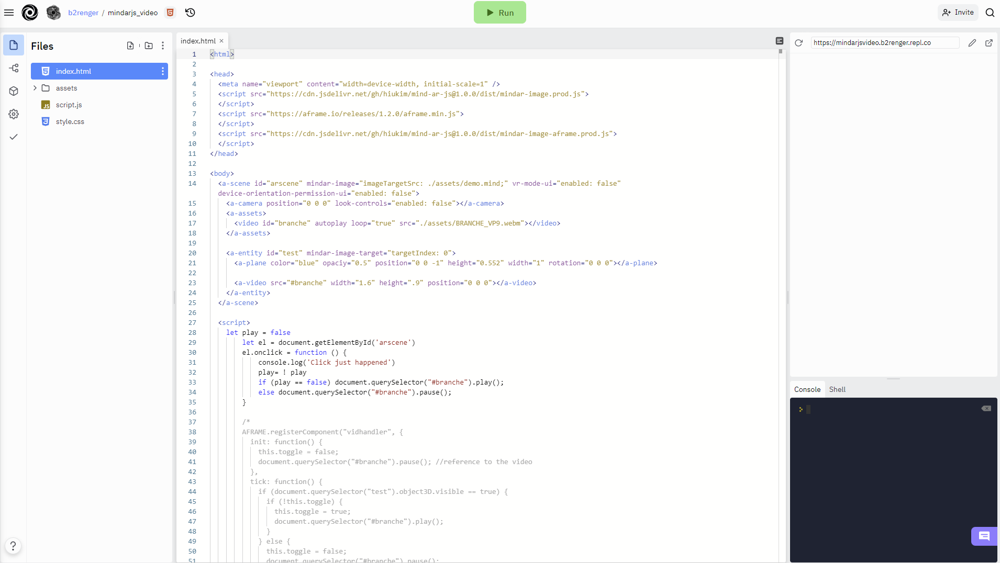
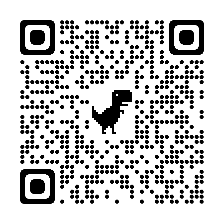
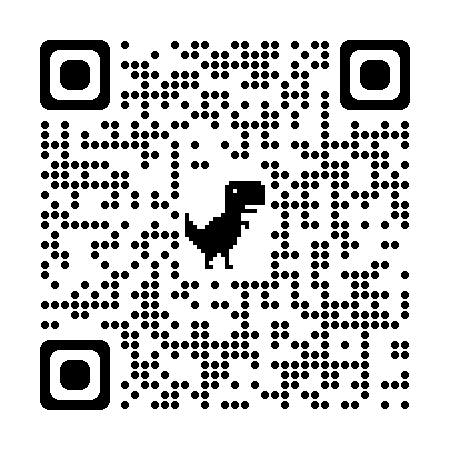

# Introduction_A-frame

Code for a creative coding class on A-Frame for designers. (AR focused)
This is not meant to be exhaustive and code oriented, the goal is to be able to add content and choose the right tracking method for a specific project.


## Contents


---
## The tools

We use three tools :
- a library for content : [A-Frame](https://aframe.io/)
- a library for marker detections in augmented reality : [ARjs](https://ar-js-org.github.io/AR.js-Docs/) 
- a webhosting plateform to write our code and host our projects : [Replit](https://replit.com/)

[**home**](#Contents)

### What is A-Frame ?
[A-Frame](https://aframe.io/docs/1.2.0/introduction/) is a free and open-source framework supported by the mozilla foundation aiming at easing the creation of 3D / VR / AR experiences in the browser. 

With this this tool it's pretty easy to use the html syntax to create 3D scenes that can then be used in any of the contexts mentionned above.

For instance this code :

```html
<html>
  <head>
    <script src="https://aframe.io/releases/1.2.0/aframe.min.js"></script>
  </head>
  <body>
    <a-scene>
      <a-box position="-1 0.5 -3" rotation="0 45 0" color="#4CC3D9"></a-box>
      <a-sphere position="0 1.25 -5" radius="1.25" color="#EF2D5E"></a-sphere>
      <a-cylinder position="1 0.75 -3" radius="0.5" height="1.5" color="#FFC65D"></a-cylinder>
      <a-plane position="0 0 -4" rotation="-90 0 0" width="4" height="4" color="#7BC8A4"></a-plane>
      <a-sky color="#ECECEC"></a-sky>
    </a-scene>
  </body>
</html>

```

Creates a scene with a sky, a floor (or plane) and 3 3D primitives (a box, a sphere and a cylinder); each element has **attributes** to specify their *position*, *rotation*, *color* etc.

<br>


The live result can be seen here : https://glitch.com/~aframe

Notice that by *clicking and dragging the mouse around* you can change your point of view, and you can even move around using you keyboard with the keys QZSD. Everything is handle behind the scenes for you.

FYI the rendering engine behind A-Frame is [Threejs](https://threejs.org/), and for advanced usage you can have access to it through code.

[**home**](#Contents)

### What is AR ?

AR is a technology that allows you to overlay digital / interactive content on a real world image in real-time. The idea is to augment our vision of the physical world with new information, graphics etc.

Well to be clear the AR world is globally a mess, in this course we choose to focus on web technologies that do work both on desktop, iOS and android to simplify the overall process and experimentations - and we also use free and open source tools.

To do that several method are use to pin / anchor the content :
- **markers detection** : you need to use a specific image to detect its position in a video feed and place content onto it.
- **image detection** : you can train a specific image of your choice to be a marker. You'll need to take a few steps though to make your program recognize your image; be aware that tracking quality will be dependent on the image you choose.
- **marker less detection** : you can detect planes in your environment that is to say : the floor, the ceilling and the walls. Though this technology is not really easily available with free and open source web technologies yet.
- **gps coordinates** : you can pin some contents to a specific gps position, but this is highly experimental at the moment and tracking is a bit shaky.
- **face detection** : you can detect the presence of a face in an image and then pin content onto it.


ARjs is a javascript library to create AR application, it allows you to track the position of markers / images and even gps coordinates.

While ARjs is the library we will use for markers and gps coordinates that is to say most use cases - we will use another one for natural images detection [mindARjs](https://hiukim.github.io/mind-ar-js-doc/quick-start/overview/)


Do keep in mind that tracking is performant when you use markers, like this one - **hiro** :

<br>

Tracking images is more challenging and you need to train an algorithm to do it and the tracking quality highly depends on the image you choose.

But just to give you an idea on how we will do all this, it's still pretty easy - check out this code :

```html
<script src="https://aframe.io/releases/0.8.0/aframe.min.js"></script>
<script src="https://cdn.rawgit.com/jeromeetienne/AR.js/1.6.0/aframe/build/aframe-ar.js"></script>
<body style='margin : 0px; overflow: hidden;'>
	<a-scene embedded arjs='sourceType: webcam;'>
		<a-box position='0 0.5 0' material='opacity: 0.5;'></a-box>
		<a-marker-camera preset='hiro'></a-marker-camera>
	</a-scene>
</body>
```

from this [article](https://medium.com/arjs/augmented-reality-in-10-lines-of-html-4e193ea9fdbf)

Try opening this qr code with your phone and show it the hiro marker above.

<br>

[**home**](#Contents)


### What is Replit ?

Replit is the plateform we will use to write code  onlineand host our project.

You'll need to create an account onto it to code and host your own examples and you'll be able to fork the examples found here.

When you are logged in and have an example open it looks like this :

<br>

On the left pannel you cand find your files.
The center pannel is dedicated to code edition.
The right pannel is you app live with below the console to track infos and errors.

On the top right corner you have a small button (right next to the adress bar) to open your program in a seperate window in fullscreen. 

[**home**](#Contents)

---
## The basic setup

An A-Frame + Arjs app is basically a web page written in html, everything will be managed under the hood for basics applications.

This follows the basic construction of webpage with the classic tags and encapsulation :
```html
<html>  

  <head>
  </head>

  <body>
  </body>

</html>
```

In between the 'head' tags we will include the libraries.
In between the 'body' tags we will include all the html tags for our scene / markers / contents.

The content will be architectured this way :

```html
<a-scene 
  options for tracking, rendering etc.
>
  <a-marker
  options for marker : what kind ? , size ?
  >

    <!-- 
      any content we want to display with their position
      anchored to the marker
    -->

  </a-marker>
</a-scene>
```


The boilerplate code you'll want to use is this one to get eveything setup and have most of usefull options ready to be tweaked later on.

It just displays a box on a kanji marker :

</br>

```html
<!doctype html>
<html>

<head>
	<script src="https://aframe.io/releases/1.2.0/aframe.min.js">

	</script>
	<script src="https://raw.githack.com/AR-js-org/AR.js/3.1.0/aframe/build/aframe-ar.js">

	</script>
</head>


<body style="margin : 0px; overflow: hidden;">

	<a-scene 
    embedded arjs="sourceType: webcam;";
    vr-mode-ui="enabled: false" 
    renderer="sortObjects: true; antialias: true; colorManagement: true; physicallyCorrectLights; logarithmicDepthBuffer: true;"
    arjs="trackingMethod: best";
    detectionMode: 'color_and_matrix' 
    changeMatrixMode: "modelViewMatrix" 
	  smooth="true" smoothCount="5" smoothTolerance=".05" smoothThreshold="5" 
    sourceWidth: "800", sourceHeight: "600", 
    displayWidth: "1280", displayHeight:"720" >

		<a-marker preset="kanji" size: "0.08">

			<a-box position='0 0 0' rotation='0 0 0' scale='1 1 1' color='#FD5D3B' material='opacity: 1;'></a-box>

		</a-marker>

		<a-camera position="0 0 0" look-controls="enabled: false"></a-camera>

	</a-scene>

</body>

</html>
```
The options in the 'a-scene' tags are numerous but we won't go into details about them to keep going forward.

You can find the code on replit here for edition / forking :
https://replit.com/@b2renger/00AFrameARboilerplate#index.html

You can run it live with this adress :
https://00aframearboilerplate.b2renger.repl.co/

or scan this qr code  and show it kanji !


</br>


Now that we have covered the tools, we will see what kind of content we can add and then, we will try several detections methods

[**home**](#Contents)

---
## Several kinds of contents

Let's get started and see how we can add some content in AR to a simple hiro marker. For all content we will refer to the [A-Frame documentation](https://aframe.io/docs/1.2.0/introduction/) : if you scroll at the **bottom of the left hand side menu** you will find links to the documentation of many primitives you can add to your scene.

</br>

With those lets create our first 3D scene !

[**home**](#Contents)

### Basic shapes

#### Getting started

A-Frame has a lot of elements you can draw directly on your scene : all the basic 3D shapes you could imagine : 

- [boxes](https://aframe.io/docs/1.2.0/primitives/a-box.html)
- [circles](https://aframe.io/docs/1.2.0/primitives/a-circle.html)
- [cones](https://aframe.io/docs/1.2.0/primitives/a-cone.html)
- [cylinders](https://aframe.io/docs/1.2.0/primitives/a-cylinder.html)
- [dodecahedron](https://aframe.io/docs/1.2.0/primitives/a-dodecahedron.html)
- [icosahedron](https://aframe.io/docs/1.2.0/primitives/a-icosahedron.html)
- [octahedron](https://aframe.io/docs/1.2.0/primitives/a-octahedron.html)
- [plane](https://aframe.io/docs/1.2.0/primitives/a-plane.html)
- [ring](https://aframe.io/docs/1.2.0/primitives/a-ring.html)
- [sphere](https://aframe.io/docs/1.2.0/primitives/a-sphere.html)
- [tetrahedron](https://aframe.io/docs/1.2.0/primitives/a-tetrahedron.html)
- [torus-knot](https://aframe.io/docs/1.2.0/primitives/a-torus-knot.html)
- [torus](https://aframe.io/docs/1.2.0/primitives/a-torus.html)
- [triangle](https://aframe.io/docs/1.2.0/primitives/a-triangle.html)

Considering the boilerplate code we've seen it can be pretty easy to build a scene by placing, rotating, scaling etc several shapes in place.

A-Frame also has some [lights](https://aframe.io/docs/1.3.0/components/light.html#sidebar) and also supports realtime [shadows](https://aframe.io/docs/1.2.0/components/shadow.html)

Consider the following code with a few objects placed in a 3D space onto a maker : 


<details>
<summary> Code </summary>

```html
<!doctype html>
<html>

<head>
	<script src="https://aframe.io/releases/1.2.0/aframe.min.js">

	</script>
	<script src="https://raw.githack.com/AR-js-org/AR.js/3.3.0/aframe/build/aframe-ar.js">

	</script>
</head>


<body style="margin : 0px; overflow: hidden;">

	<a-scene 
    embedded arjs="sourceType: webcam;";
    vr-mode-ui="enabled: false" 
    renderer="sortObjects: true; antialias: true; colorManagement: true; physicallyCorrectLights; logarithmicDepthBuffer: true;"
    arjs="trackingMethod: best";
    detectionMode: 'color_and_matrix' 
    changeMatrixMode: "modelViewMatrix" 
	  smooth="true" smoothCount="5" smoothTolerance=".05" smoothThreshold="5" 
    sourceWidth: "800", sourceHeight: "600", 
    displayWidth: "1280", displayHeight:"720"
    shadow="autoUpdate: true; enabled: true; type:pcf"
    light="defaultLightsEnabled: false"
     >

		<a-marker  preset="kanji" size: "0.8">
      
      <a-light type="spot" castShadow="true" color="white" position="-1 10 3" rotation="0 0 0" target="#directionaltarget"></a-light>
 
      <a-entity id="directionaltarget" position="0 0 0"></a-entity>
      

			<a-box position='0 .8 0' rotation='0 0 0' scale='1 1 1' color='#5800FF' material='opacity: 1;'shadow="receive: true; cast:true" ></a-box>

      <a-dodecahedron position='-1.25 .8 0' color="#E900FF" radius=".5" shadow="receive: true; cast:true" ></a-dodecahedron>

      <a-torus-knot position='1.25 .8 0' rotation='90 90 0' color="#FFC600" arc="180" p="2" q="7" radius=".25" radius-tubular="0.01" shadow="receive: true; cast:true"></a-torus-knot>

      <a-plane position='0 0 0' rotation="-90 0 0" width="4" height="4" color='#FFFFFF' side="double"  shadow="receive: true; cast:true"></a-plane>
     

		</a-marker>

		<a-camera position="0 0 0" look-controls="enabled: false"></a-camera>

	</a-scene>

</body>

</html>
```

</details>

You can find the code on replit here for edition / forking :
https://replit.com/@b2renger/01AFrameARShapes#index.html

You can run it live with this adress :
https://01aframearshapes.b2renger.repl.co/

or scan this qr code  and show it kanji !


</br>


[**home**](#Contents)

#### Mixins and texturing

As you get more confortable using primitives, one technique can be usefull to create more re-usable components and allow you to diminish the amount of code you have to type in to get a proper scene running; so let's learn about the [mixins](https://aframe.io/docs/1.2.0/core/mixins.html) !

A **mixin** is basically a way to define an element to be reused later on when building a scene. We can define colors, shapes etc.

A mixin is defined in between **a-assets** tags and uses **a-mixin**. One important point is to give an id to each mixin. This id will be used to recall the shapes or colors we defined.

```html
 <a-assets>
    <!-- define some colors -->
    <a-mixin id="green" material="color: green"></a-mixin>
    <a-mixin id="brown" material="color: brown"></a-mixin>
    <a-mixin id="darkbrown" material="color:#7e5835 "></a-mixin>
    <a-mixin id="lightgreen" material="color:#a5d152 "></a-mixin>
    <!-- define some geometries -->
    <a-mixin id="trunk" geometry="primitive: box ; width:.25; height:1; depth:.25"></a-mixin>
    <a-mixin id="treetop" geometry="primitive: cone ; radius-bottom:.5; radius-top:0"></a-mixin>
    <a-mixin id="othertreetop" geometry="primitive: dodecahedron ; radius:.75"></a-mixin>
  </a-assets>
  ```

Now in our scene we can build objects based on those mixins :

- brown trunk and green treetop
```html
<a-entity mixin="brown trunk" position = "0 .5 0"></a-entity>
<a-entity mixin="green treetop" position = "0 1.5 0"></a-entity>
```

- or a darkbrown trunk and a lightgreen othertreetop
```html
<a-entity mixin="darkbrown trunk" position = "-1.25 .5 0" ></a-entity>
<a-entity mixin="lightgreen othertreetop" position = "-1.25 1.5 0"></a-entity>
```

Let's now texture a plane that will represent a ground. The textures should be added as [materials](https://aframe.io/docs/1.2.0/components/material.html). A material can be as simple as a color or it can also be a texture (or image), and if you know about 3D, you can also add some maps like normal map, displacement map, or AO map.

For our examples we will use textures from this [link](https://polyhaven.com/a/forest_leaves_02) - (btw [polyhaven](https://polyhaven.com) is awesome !)

First you need to load your image into replit you can just drag and drop it onto the 'assets' folder. Then in the assets part of our programm you can import it:

```html

```

Then in the **a-plane** object (or in any entity) you can set the **src** for the **material** like this :

```html
<a-plane position='0 0 0' rotation="-90 0 0" width="4" height="4" material="src: #leavestex;"></a-plane>
```

You can also add normal or displacement map to any object, but be sure if you use a displacement map to have some vertices to displace. You can setup the subdivision of your plane with *segments-height* and *segments-width*.


You can have a look at the code here :

<details>
    <summary>Code</summary>

```html
<!doctype html>
<html>

<head>
	<script src="https://aframe.io/releases/1.2.0/aframe.min.js">

	</script>
	<script src="https://raw.githack.com/AR-js-org/AR.js/3.3.0/aframe/build/aframe-ar.js">

	</script>
</head>


<body style="margin : 0px; overflow: hidden;">

	<a-scene 
    embedded arjs="sourceType: webcam;";
    vr-mode-ui="enabled: false" 
    renderer="sortObjects: true; antialias: true; colorManagement: true; physicallyCorrectLights; logarithmicDepthBuffer: true;"
    arjs="trackingMethod: best";
    detectionMode: 'color_and_matrix' 
    changeMatrixMode: "modelViewMatrix" 
	  smooth="true" smoothCount="5" smoothTolerance=".05" smoothThreshold="5" 
    sourceWidth: "800", sourceHeight: "600", 
    displayWidth: "1280", displayHeight:"720"
    shadow="autoUpdate: true; enabled: true; type:pcf"
    light="defaultLightsEnabled: false"
     >

  <a-assets>
    <!-- define some colors -->
    <a-mixin id="green" material="color: green"></a-mixin>
    <a-mixin id="brown" material="color: brown"></a-mixin>
    <a-mixin id="darkbrown" material="color:#7e5835 "></a-mixin>
    <a-mixin id="lightgreen" material="color:#a5d152 "></a-mixin>
    <!-- define some geometries -->
    <a-mixin id="trunk" geometry="primitive: box ; width:.25; height:1; depth:.25"></a-mixin>
    <a-mixin id="treetop" geometry="primitive: cone ; radius-bottom:.5; radius-top:0"></a-mixin>
    <a-mixin id="othertreetop" geometry="primitive: dodecahedron ; radius:.75"></a-mixin>
    <!-- load some textures-->
    
    
    


  </a-assets>
       
    
  
		<a-marker  preset="kanji" size: "0.8">

      
      <a-light type="spot" castShadow="true" color="white" intensity="2" position="-1 5 2"  target="#directionaltarget"></a-light>
      <a-entity id="directionaltarget" position="0 0 0"></a-entity>
      
      <a-entity mixin="brown trunk" position = "0 .5 0"></a-entity>
      <a-entity mixin="green treetop" position = "0 1.5 0"></a-entity>

      <a-entity mixin="darkbrown trunk" position = "1.25 .5 0" geometry="height:1.5"></a-entity>
      <a-entity mixin="lightgreen treetop" position = "1.25 2 0" geometry="height:1.5"></a-entity>

      <a-entity mixin="darkbrown trunk" position = "-1.25 .5 0" ></a-entity>
      <a-entity mixin="lightgreen othertreetop" position = "-1.25 1.5 0"></a-entity>


      <a-plane position='0 0 0' rotation="-90 0 0" width="4" height="4"
        "100" segments-width="100"
      material="src: #leavestex; normalMap:#leavesnorm;displacementMap:#leavesdisp; displacementBias:-0.5; displacementScale:1" shadow="receive: true; cast:true"></a-plane>

     

		</a-marker>

		<a-camera position="0 0 0" look-controls="enabled: false"></a-camera>

	</a-scene>

</body>

</html>

```
</details>

You can find the code on replit here for edition / forking :
https://replit.com/@b2renger/02AFrameARShapesmixins#index.html

You can run it live with this adress :
https://02aframearshapesmixins.b2renger.repl.co/

or scan this qr code  and show it kanji !


</br>


[**home**](#Contents)


### Images

Putting images in ar experiences is pretty straight forward. We will use the same kind of code as before.

First you need to load your image into replit you can just drag and drop it onto the 'assets' folder. Then in the assets part of our programm you can import it:

```html
<a-assets>
  
</a-assets> 
```

Then we will use the **"a-image"** tag to display it on the marker :

```html
<a-marker  preset="kanji" size: "0.8">
  <a-image src="#transparent_image" rotation="90 0 0" width="2" height="2"></a-image>
</a-marker>
```
Easy !

The important part is to understand how the image is linked from the assets to the specific tag. For that we use the *id* in the assets that should match the *src* in the "a-image" tag.


You can have a look at the code here :

<details>
    <summary>Code</summary>

```html
<!doctype html>
<html>

<head>
	<script src="https://aframe.io/releases/1.2.0/aframe.min.js">

	</script>
	<script src="https://raw.githack.com/AR-js-org/AR.js/3.3.0/aframe/build/aframe-ar.js">

	</script>
</head>


<body style="margin : 0px; overflow: hidden;">

	<a-scene 
    embedded arjs="sourceType: webcam;";
    vr-mode-ui="enabled: false" 
    renderer="sortObjects: true; antialias: true; colorManagement: true; physicallyCorrectLights; logarithmicDepthBuffer: true;"
    arjs="trackingMethod: best";
    detectionMode: 'color_and_matrix' 
    changeMatrixMode: "modelViewMatrix" 
	  smooth="true" smoothCount="5" smoothTolerance=".05" smoothThreshold="5" 
    sourceWidth: "800", sourceHeight: "600", 
    displayWidth: "1280", displayHeight:"720"
    shadow="autoUpdate: true; enabled: true; type:pcf"
    light="defaultLightsEnabled: false"
     >

  <a-assets>

  </a-assets>
       
    
  
		<a-marker  preset="kanji" size: "0.8">
      <a-image src="#transparent_image" rotation="90 0 0" width="2" height="2"></a-image>
		</a-marker>

		<a-camera position="0 0 0" look-controls="enabled: false"></a-camera>

	</a-scene>

</body>

</html>

```

</details>

You can find the code on replit here for edition / forking :
https://replit.com/@b2renger/03AFRAMEARImages#index.html

You can run it live with this adress :
https://03aframearimages.b2renger.repl.co/

or scan this qr code  and show it kanji !


</br>


[**home**](#Contents)

### Videos

[**home**](#Contents)

### Texts

[**home**](#Contents)

### P5js sketches

[**home**](#Contents)

### 3d models

[**home**](#Contents)

---
## Several kinds of detections

Why size matters ? - https://stackoverflow.com/questions/67788982/ar-js-is-difficult-for-vertically-placed-image-tracking-does-ar-even-make-sens
[**home**](#Contents)

### Hiro and Kanji

[**home**](#Contents)

### Barcode markers

[**home**](#Contents)

### Custom marker 

[**home**](#Contents)


### GPS coordinates
" - Wait ... what ?! 
  - Yes ! yes GPS coordinates as anchors ! "

[**home**](#Contents)

### Images as marker (mind-arjs)

[**home**](#Contents)

### Face tracking (minde-arjs)

[**home**](#Contents)

--- 
## Qr codes and "marker codes"

[**home**](#Contents)

## Animations

[**home**](#Contents)

## Interactivity

[**home**](#Contents)


---
## Extending AFrame

https://aframe.io/aframe-registry/

[**home**](#Contents)

## Links and references

### references and sources

get started : https://medium.com/arjs/augmented-reality-in-10-lines-of-html-4e193ea9fdbf

marker codes : https://nicolcarpignoli.medium.com/how-to-deliver-ar-on-the-web-only-with-a-qr-code-139bb90e82f1

size matters : https://stackoverflow.com/questions/67788982/ar-js-is-difficult-for-vertically-placed-image-tracking-does-ar-even-make-sens


[**home**](#Contents)

### go further
https://medium.com/samsung-internet-dev/use-new-augmented-reality-features-with-just-a-few-lines-of-code-with-webxr-and-aframe-c6f3f5789345

https://ericjinks.com/blog/2017/creating-a-webvr-synth/

[**home**](#Contents)
