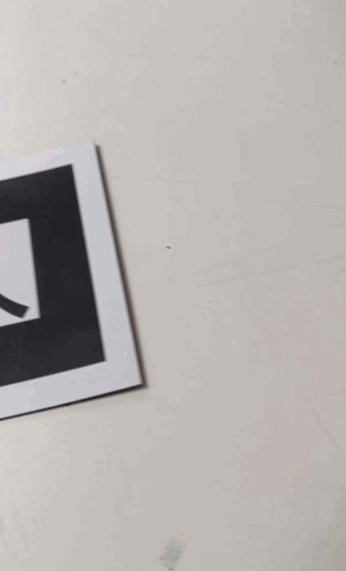
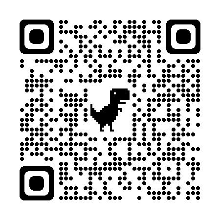
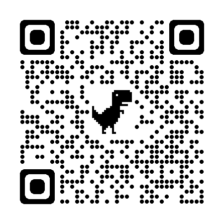
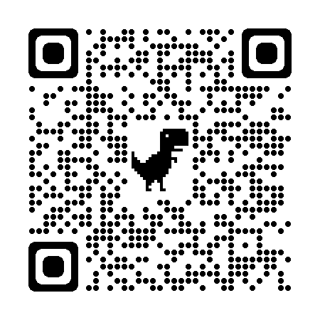
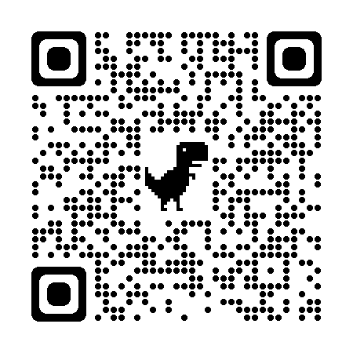

# Introduction_A-frame

Code for a creative coding class on A-Frame for designers. (AR focused)
This is not meant to be exhaustive and code oriented, the goal is to be able to add content and choose the right tracking method for a specific project.


## Contents


---
## The tools

We use three tools :
- a library for content : [A-Frame](https://aframe.io/)
- a library for marker detections in augmented reality : [ARjs](https://ar-js-org.github.io/AR.js-Docs/) 
- a webhosting plateform to write our code and host our projects : [Replit](https://replit.com/)

[**home**](#Contents)

### What is A-Frame ?
[A-Frame](https://aframe.io/docs/1.2.0/introduction/) is a free and open-source framework supported by the mozilla foundation aiming at easing the creation of 3D / VR / AR experiences in the browser. 

With this this tool it's pretty easy to use the html syntax to create 3D scenes that can then be used in any of the contexts mentionned above.

For instance this code :

```html
<html>
  <head>
    <script src="https://aframe.io/releases/1.2.0/aframe.min.js"></script>
  </head>
  <body>
    <a-scene>
      <a-box position="-1 0.5 -3" rotation="0 45 0" color="#4CC3D9"></a-box>
      <a-sphere position="0 1.25 -5" radius="1.25" color="#EF2D5E"></a-sphere>
      <a-cylinder position="1 0.75 -3" radius="0.5" height="1.5" color="#FFC65D"></a-cylinder>
      <a-plane position="0 0 -4" rotation="-90 0 0" width="4" height="4" color="#7BC8A4"></a-plane>
      <a-sky color="#ECECEC"></a-sky>
    </a-scene>
  </body>
</html>

```

Creates a scene with a sky, a floor (or plane) and 3 3D primitives (a box, a sphere and a cylinder); each element has **attributes** to specify their *position*, *rotation*, *color* etc.

<br>


The live result can be seen here : https://glitch.com/~aframe

Notice that by *clicking and dragging the mouse around* you can change your point of view, and you can even move around using you keyboard with the keys QZSD. Everything is handle behind the scenes for you.

FYI the rendering engine behind A-Frame is [Threejs](https://threejs.org/), and for advanced usage you can have access to it through code.

[**home**](#Contents)

### What is AR ?

AR is a technology that allows you to overlay digital / interactive content on a real world image in real-time. The idea is to augment our vision of the physical world with new information, graphics etc.

Well to be clear the AR world is globally a mess, in this course we choose to focus on web technologies that do work both on desktop, iOS and android to simplify the overall process and experimentations - and we also use free and open source tools.

To do that several method are use to pin / anchor the content :
- **markers detection** : you need to use a specific image to detect its position in a video feed and place content onto it.
- **image detection** : you can train a specific image of your choice to be a marker. You'll need to take a few steps though to make your program recognize your image; be aware that tracking quality will be dependent on the image you choose.
- **marker less detection** : you can detect planes in your environment that is to say : the floor, the ceilling and the walls. Though this technology is not really easily available with free and open source web technologies yet.
- **gps coordinates** : you can pin some contents to a specific gps position, but this is highly experimental at the moment and tracking is a bit shaky.
- **face detection** : you can detect the presence of a face in an image and then pin content onto it.


ARjs is a javascript library to create AR application, it allows you to track the position of markers / images and even gps coordinates.

While ARjs is the library we will use for markers and gps coordinates that is to say most use cases - we will use another one for natural images detection [mindARjs](https://hiukim.github.io/mind-ar-js-doc/quick-start/overview/)


Do keep in mind that tracking is performant when you use markers, like this one - **hiro** :

<br>

Tracking images is more challenging and you need to train an algorithm to do it and the tracking quality highly depends on the image you choose.

But just to give you an idea on how we will do all this, it's still pretty easy - check out this code :

```html
<script src="https://aframe.io/releases/0.8.0/aframe.min.js"></script>
<script src="https://cdn.rawgit.com/jeromeetienne/AR.js/1.6.0/aframe/build/aframe-ar.js"></script>
<body style='margin : 0px; overflow: hidden;'>
	<a-scene embedded arjs='sourceType: webcam;'>
		<a-box position='0 0.5 0' material='opacity: 0.5;'></a-box>
		<a-marker-camera preset='hiro'></a-marker-camera>
	</a-scene>
</body>
```

from this [article](https://medium.com/arjs/augmented-reality-in-10-lines-of-html-4e193ea9fdbf)

Try opening this qr code with your phone and show it the hiro marker above.

<br>

[**home**](#Contents)


### What is Replit ?

Replit is the plateform we will use to write code  onlineand host our project.

You'll need to create an account onto it to code and host your own examples and you'll be able to fork the examples found here.

When you are logged in and have an example open it looks like this :

<br>

On the left pannel you cand find your files.
The center pannel is dedicated to code edition.
The right pannel is you app live with below the console to track infos and errors.

On the top right corner you have a small button (right next to the adress bar) to open your program in a seperate window in fullscreen. 

[**home**](#Contents)

---
## The basic setup

An A-Frame + Arjs app is basically a web page written in html, everything will be managed under the hood for basics applications.

This follows the basic construction of webpage with the classic tags and encapsulation :
```html
<html>  

  <head>
  </head>

  <body>
  </body>

</html>
```

In between the 'head' tags we will include the libraries.
In between the 'body' tags we will include all the html tags for our scene / markers / contents.

The content will be architectured this way :

```html
<a-scene 
  options for tracking, rendering etc.
>
  <a-marker
  options for marker : what kind ? , size ?
  >

    <!-- 
      any content we want to display with their position
      anchored to the marker
    -->

  </a-marker>
</a-scene>
```


The boilerplate code you'll want to use is this one to get eveything setup and have most of usefull options ready to be tweaked later on.

It just displays a box on a kanji marker :

</br>

```html
<!doctype html>
<html>

<head>
	<script src="https://aframe.io/releases/1.2.0/aframe.min.js">

	</script>
	<script src="https://raw.githack.com/AR-js-org/AR.js/3.1.0/aframe/build/aframe-ar.js">

	</script>
</head>


<body style="margin : 0px; overflow: hidden;">

	<a-scene 
    embedded arjs="sourceType: webcam;";
    vr-mode-ui="enabled: false" 
    renderer="sortObjects: true; antialias: true; colorManagement: true; physicallyCorrectLights; logarithmicDepthBuffer: true;"
    arjs="trackingMethod: best";
    detectionMode: 'color_and_matrix' 
    changeMatrixMode: "modelViewMatrix" 
	  smooth="true" smoothCount="5" smoothTolerance=".05" smoothThreshold="5" 
    sourceWidth: "800", sourceHeight: "600", 
    displayWidth: "1280", displayHeight:"720" >

		<a-marker preset="kanji" size: "0.08">

			<a-box position='0 0 0' rotation='0 0 0' scale='1 1 1' color='#FD5D3B' material='opacity: 1;'></a-box>

		</a-marker>

		<a-camera position="0 0 0" look-controls="enabled: false"></a-camera>

	</a-scene>

</body>

</html>
```
The options in the 'a-scene' tags are numerous but we won't go into details about them to keep going forward.

You can find the code on replit here for edition / forking :
https://replit.com/@b2renger/00AFrameARboilerplate#index.html

You can run it live with this adress :
https://00aframearboilerplate.b2renger.repl.co/

or scan this qr code  and show it kanji !


</br>


Now that we have covered the tools, we will see what kind of content we can add and then, we will try several detections methods

[**home**](#Contents)

---
## Several kinds of contents

Let's get started and see how we can add some content in AR to a simple hiro marker. For all content we will refer to the [A-Frame documentation](https://aframe.io/docs/1.2.0/introduction/) : if you scroll at the **bottom of the left hand side menu** you will find links to the documentation of many primitives you can add to your scene.

</br>

With those lets create our first 3D scene !

[**home**](#Contents)

### Basic shapes

#### Getting started

A-Frame has a lot of elements you can draw directly on your scene : all the basic 3D shapes you could imagine : 

- [boxes](https://aframe.io/docs/1.2.0/primitives/a-box.html)
- [circles](https://aframe.io/docs/1.2.0/primitives/a-circle.html)
- [cones](https://aframe.io/docs/1.2.0/primitives/a-cone.html)
- [cylinders](https://aframe.io/docs/1.2.0/primitives/a-cylinder.html)
- [dodecahedron](https://aframe.io/docs/1.2.0/primitives/a-dodecahedron.html)
- [icosahedron](https://aframe.io/docs/1.2.0/primitives/a-icosahedron.html)
- [octahedron](https://aframe.io/docs/1.2.0/primitives/a-octahedron.html)
- [plane](https://aframe.io/docs/1.2.0/primitives/a-plane.html)
- [ring](https://aframe.io/docs/1.2.0/primitives/a-ring.html)
- [sphere](https://aframe.io/docs/1.2.0/primitives/a-sphere.html)
- [tetrahedron](https://aframe.io/docs/1.2.0/primitives/a-tetrahedron.html)
- [torus-knot](https://aframe.io/docs/1.2.0/primitives/a-torus-knot.html)
- [torus](https://aframe.io/docs/1.2.0/primitives/a-torus.html)
- [triangle](https://aframe.io/docs/1.2.0/primitives/a-triangle.html)

Considering the boilerplate code we've seen it can be pretty easy to build a scene by placing, rotating, scaling etc several shapes in place.

A-Frame also has some [lights](https://aframe.io/docs/1.3.0/components/light.html#sidebar) and also supports realtime [shadows](https://aframe.io/docs/1.2.0/components/shadow.html)

Consider the following code with a few objects placed in a 3D space onto a maker : 


<details>
<summary> Code </summary>

```html
<!doctype html>
<html>

<head>
	<script src="https://aframe.io/releases/1.2.0/aframe.min.js">

	</script>
	<script src="https://raw.githack.com/AR-js-org/AR.js/3.3.0/aframe/build/aframe-ar.js">

	</script>
</head>


<body style="margin : 0px; overflow: hidden;">

	<a-scene 
    embedded arjs="sourceType: webcam;";
    vr-mode-ui="enabled: false" 
    renderer="sortObjects: true; antialias: true; colorManagement: true; physicallyCorrectLights; logarithmicDepthBuffer: true;"
    arjs="trackingMethod: best";
    detectionMode: 'color_and_matrix' 
    changeMatrixMode: "modelViewMatrix" 
	  smooth="true" smoothCount="5" smoothTolerance=".05" smoothThreshold="5" 
    sourceWidth: "800", sourceHeight: "600", 
    displayWidth: "1280", displayHeight:"720"
    shadow="autoUpdate: true; enabled: true; type:pcf"
    light="defaultLightsEnabled: false"
     >

		<a-marker  preset="kanji" size: "0.8">
      
      <a-light type="spot" castShadow="true" color="white" position="-1 10 3" rotation="0 0 0" target="#directionaltarget"></a-light>
 
      <a-entity id="directionaltarget" position="0 0 0"></a-entity>
      

			<a-box position='0 .8 0' rotation='0 0 0' scale='1 1 1' color='#5800FF' material='opacity: 1;'shadow="receive: true; cast:true" ></a-box>

      <a-dodecahedron position='-1.25 .8 0' color="#E900FF" radius=".5" shadow="receive: true; cast:true" ></a-dodecahedron>

      <a-torus-knot position='1.25 .8 0' rotation='90 90 0' color="#FFC600" arc="180" p="2" q="7" radius=".25" radius-tubular="0.01" shadow="receive: true; cast:true"></a-torus-knot>

      <a-plane position='0 0 0' rotation="-90 0 0" width="4" height="4" color='#FFFFFF' side="double"  shadow="receive: true; cast:true"></a-plane>
     

		</a-marker>

		<a-camera position="0 0 0" look-controls="enabled: false"></a-camera>

	</a-scene>

</body>

</html>
```

</details>

You can find the code on replit here for edition / forking :
https://replit.com/@b2renger/01AFrameARShapes#index.html

You can run it live with this adress :
https://01aframearshapes.b2renger.repl.co/

or scan this qr code  and show it kanji !


</br>


[**home**](#Contents)

#### Mixins and texturing

As you get more confortable using primitives, one technique can be usefull to create more re-usable components and allow you to diminish the amount of code you have to type in to get a proper scene running; so let's learn about the [mixins](https://aframe.io/docs/1.2.0/core/mixins.html) !

A **mixin** is basically a way to define an element to be reused later on when building a scene. We can define colors, shapes etc.

A mixin is defined in between **a-assets** tags and uses **a-mixin**. One important point is to give an id to each mixin. This id will be used to recall the shapes or colors we defined.

```html
 <a-assets>
    <!-- define some colors -->
    <a-mixin id="green" material="color: green"></a-mixin>
    <a-mixin id="brown" material="color: brown"></a-mixin>
    <a-mixin id="darkbrown" material="color:#7e5835 "></a-mixin>
    <a-mixin id="lightgreen" material="color:#a5d152 "></a-mixin>
    <!-- define some geometries -->
    <a-mixin id="trunk" geometry="primitive: box ; width:.25; height:1; depth:.25"></a-mixin>
    <a-mixin id="treetop" geometry="primitive: cone ; radius-bottom:.5; radius-top:0"></a-mixin>
    <a-mixin id="othertreetop" geometry="primitive: dodecahedron ; radius:.75"></a-mixin>
  </a-assets>
  ```

Now in our scene we can build objects based on those mixins :

- brown trunk and green treetop
```html
<a-entity mixin="brown trunk" position = "0 .5 0"></a-entity>
<a-entity mixin="green treetop" position = "0 1.5 0"></a-entity>
```

- or a darkbrown trunk and a lightgreen othertreetop
```html
<a-entity mixin="darkbrown trunk" position = "-1.25 .5 0" ></a-entity>
<a-entity mixin="lightgreen othertreetop" position = "-1.25 1.5 0"></a-entity>
```

Let's now texture a plane that will represent a ground. The textures should be added as [materials](https://aframe.io/docs/1.2.0/components/material.html). A material can be as simple as a color or it can also be a texture (or image), and if you know about 3D, you can also add some maps like normal map, displacement map, or AO map.

For our examples we will use textures from this [link](https://polyhaven.com/a/forest_leaves_02) - (btw [polyhaven](https://polyhaven.com) is awesome !)

First you need to load your image into replit you can just drag and drop it onto the 'assets' folder. Then in the assets part of our programm you can import it:

```html

```

Then in the **a-plane** object (or in any entity) you can set the **src** for the **material** like this :

```html
<a-plane position='0 0 0' rotation="-90 0 0" width="4" height="4" material="src: #leavestex;"></a-plane>
```

You can also add normal or displacement map to any object, but be sure if you use a displacement map to have some vertices to displace. You can setup the subdivision of your plane with *segments-height* and *segments-width*.


You can have a look at the code here :

<details>
    <summary>Code</summary>

```html
<!doctype html>
<html>

<head>
	<script src="https://aframe.io/releases/1.2.0/aframe.min.js">

	</script>
	<script src="https://raw.githack.com/AR-js-org/AR.js/3.3.0/aframe/build/aframe-ar.js">

	</script>
</head>


<body style="margin : 0px; overflow: hidden;">

	<a-scene 
    embedded arjs="sourceType: webcam;";
    vr-mode-ui="enabled: false" 
    renderer="sortObjects: true; antialias: true; colorManagement: true; physicallyCorrectLights; logarithmicDepthBuffer: true;"
    arjs="trackingMethod: best";
    detectionMode: 'color_and_matrix' 
    changeMatrixMode: "modelViewMatrix" 
	  smooth="true" smoothCount="5" smoothTolerance=".05" smoothThreshold="5" 
    sourceWidth: "800", sourceHeight: "600", 
    displayWidth: "1280", displayHeight:"720"
    shadow="autoUpdate: true; enabled: true; type:pcf"
    light="defaultLightsEnabled: false"
     >

  <a-assets>
    <!-- define some colors -->
    <a-mixin id="green" material="color: green"></a-mixin>
    <a-mixin id="brown" material="color: brown"></a-mixin>
    <a-mixin id="darkbrown" material="color:#7e5835 "></a-mixin>
    <a-mixin id="lightgreen" material="color:#a5d152 "></a-mixin>
    <!-- define some geometries -->
    <a-mixin id="trunk" geometry="primitive: box ; width:.25; height:1; depth:.25"></a-mixin>
    <a-mixin id="treetop" geometry="primitive: cone ; radius-bottom:.5; radius-top:0"></a-mixin>
    <a-mixin id="othertreetop" geometry="primitive: dodecahedron ; radius:.75"></a-mixin>
    <!-- load some textures-->
    
    
    


  </a-assets>
       
    
  
		<a-marker  preset="kanji" size: "0.8">

      
      <a-light type="spot" castShadow="true" color="white" intensity="2" position="-1 5 2"  target="#directionaltarget"></a-light>
      <a-entity id="directionaltarget" position="0 0 0"></a-entity>
      
      <a-entity mixin="brown trunk" position = "0 .5 0"></a-entity>
      <a-entity mixin="green treetop" position = "0 1.5 0"></a-entity>

      <a-entity mixin="darkbrown trunk" position = "1.25 .5 0" geometry="height:1.5"></a-entity>
      <a-entity mixin="lightgreen treetop" position = "1.25 2 0" geometry="height:1.5"></a-entity>

      <a-entity mixin="darkbrown trunk" position = "-1.25 .5 0" ></a-entity>
      <a-entity mixin="lightgreen othertreetop" position = "-1.25 1.5 0"></a-entity>


      <a-plane position='0 0 0' rotation="-90 0 0" width="4" height="4"
        "100" segments-width="100"
      material="src: #leavestex; normalMap:#leavesnorm;displacementMap:#leavesdisp; displacementBias:-0.5; displacementScale:1" shadow="receive: true; cast:true"></a-plane>

     

		</a-marker>

		<a-camera position="0 0 0" look-controls="enabled: false"></a-camera>

	</a-scene>

</body>

</html>

```
</details>

You can find the code on replit here for edition / forking :
https://replit.com/@b2renger/02AFrameARShapesmixins#index.html

You can run it live with this adress :
https://02aframearshapesmixins.b2renger.repl.co/

or scan this qr code  and show it kanji !


</br>


[**home**](#Contents)


### Images

Putting images in ar experiences is pretty straight forward. We will use the same kind of code as before.

First you need to load your image into replit you can just drag and drop it onto the 'assets' folder. 


Then in the assets part of our programm you can import it:

```html
<a-assets>
  
</a-assets> 
```

Then we will use the **"a-image"** tag to display it on the marker :

```html
<a-marker  preset="kanji" size: "0.8">
  <a-image src="#transparent_image" rotation="90 0 0" width="2" height="2"></a-image>
</a-marker>
```
Easy !

The important part is to understand how the image is linked from the assets to the specific tag. For that we use the *id* in the assets that should match the *src* in the "a-image" tag.


You can have a look at the code here :

<details>
    <summary>Code</summary>

```html
<!doctype html>
<html>

<head>
	<script src="https://aframe.io/releases/1.2.0/aframe.min.js">

	</script>
	<script src="https://raw.githack.com/AR-js-org/AR.js/3.3.0/aframe/build/aframe-ar.js">

	</script>
</head>


<body style="margin : 0px; overflow: hidden;">

	<a-scene 
    embedded arjs="sourceType: webcam;";
    vr-mode-ui="enabled: false" 
    renderer="sortObjects: true; antialias: true; colorManagement: true; physicallyCorrectLights; logarithmicDepthBuffer: true;"
    arjs="trackingMethod: best";
    detectionMode: 'color_and_matrix' 
    changeMatrixMode: "modelViewMatrix" 
	  smooth="true" smoothCount="5" smoothTolerance=".05" smoothThreshold="5" 
    sourceWidth: "800", sourceHeight: "600", 
    displayWidth: "1280", displayHeight:"720"
    shadow="autoUpdate: true; enabled: true; type:pcf"
    light="defaultLightsEnabled: false"
     >

  <a-assets>

  </a-assets>
       
    
  
		<a-marker  preset="kanji" size: "0.8">
      <a-image src="#transparent_image" rotation="90 0 0" width="2" height="2"></a-image>
		</a-marker>

		<a-camera position="0 0 0" look-controls="enabled: false"></a-camera>

	</a-scene>

</body>

</html>

```

</details>

You can find the code on replit here for edition / forking :
https://replit.com/@b2renger/03AFRAMEARImages#index.html

You can run it live with this adress :
https://03aframearimages.b2renger.repl.co/

or scan this qr code  and show it kanji !


</br>


[**home**](#Contents)

### Videos

It's pretty much the same as images except we use the 'a-video' tag.

The source video for this example is available [here](https://www.pexels.com/fr-fr/video/groupe-de-meduses-dans-l-aquarium-3616367/)

So :
- you drag and drop your video in the assets folder of replit (same as with images) but beware of the size of the video ! we are on the web so big videos means a lot of loading time and many energy consumed.
- load the video inside the asset tag of our scene
  ```html
  <a-assets>
    <video 
      id="vid" 
      src="./assets/video.mp4"
      autoplay="true"
      loop="true"
      preload="auto"
      controls="true"
      playsinline=""
      webkit-playsinline=""
      
      ></video>
  </a-assets>
  ```
- diplay the video on the marker 
  ```html
  	<a-marker vidhandler preset="kanji" size: "0.8">
      <a-video src="#vid" rotation="90 0 0" width="2" height="1.5"></a-video>
		</a-marker>
  ```

Well the video is displayed but it doesn't actually play and that's another story if you  want to play the video. 

Most of the videos in a webpage aren't allowed to just do autplay. So you may need to create a little script : the idea is to play the video only if the marker is visible. 

Let's take a look at the scripting tools we can use in A-Frame !
You may have noticed that in the "a-marker" tag the word "vidhandler". This key work can be used to attach a script - and by script we do mean a bit of code to handle interactivity.

There is a full article on [how to write a component for a-frame](https://aframe.io/docs/1.2.0/introduction/writing-a-component.html#registering-the-component-with-aframe-registercomponent)

Basically we need to :
- register the component with a frame system (registerComponent)
- write what it does on load (in the init function)
- write what it does every frame (in the tick function)

```html
  <script>
    AFRAME.registerComponent("vidhandler", {
      init: function() {
        this.toggle = false;
        document.querySelector("#vid").pause(); //reference to the video
      },
      tick: function() {        
        if (document.querySelector("a-marker").object3D.visible == true) { // get the state of our marker : is it visible ?
          if (!this.toggle) {
            this.toggle = true;
            document.querySelector("#vid").play();
          }
        } else {
          this.toggle = false;
          document.querySelector("#vid").pause();
        }
      }
    });
  </script>
```



You can have a look at the code here :

<details>
    <summary>Code</summary>

```html

<!doctype html>
<html>
<head>
	<script src="https://aframe.io/releases/1.2.0/aframe.min.js">

	</script>
	<script src="https://raw.githack.com/AR-js-org/AR.js/3.3.0/aframe/build/aframe-ar.js">

	</script>
</head>


<body style="margin : 0px; overflow: hidden;">

	<a-scene 
    embedded arjs="sourceType: webcam;";
    vr-mode-ui="enabled: false" 
    renderer="sortObjects: true; antialias: true; colorManagement: true; physicallyCorrectLights; logarithmicDepthBuffer: true;"
    arjs="trackingMethod: best";
    detectionMode: 'color_and_matrix' 
    changeMatrixMode: "modelViewMatrix" 
	  smooth="true" smoothCount="5" smoothTolerance=".05" smoothThreshold="5" 
    sourceWidth: "800", sourceHeight: "600", 
    displayWidth: "1280", displayHeight:"720"
    shadow="autoUpdate: true; enabled: true; type:pcf"
    light="defaultLightsEnabled: false"
    
     >

  <a-assets>
    <video 
      id="vid" 
      src="./assets/video.mp4"
      autoplay="true"
      loop="true"
      preload="auto"
      controls="true"
      playsinline=""
      webkit-playsinline=""
      
      ></video>
  </a-assets>
       
    
  
		<a-marker   vidhandler id="vid-marker" preset="kanji" size: "0.8">
      <a-video src="#vid" rotation="90 0 0" width="2" height="1.5"></a-video>
		</a-marker>

		<a-camera position="0 0 0" look-controls="enabled: false"></a-camera>

	</a-scene>

  <script>
    AFRAME.registerComponent("vidhandler", {
      init: function() {
        this.toggle = false;
        document.querySelector("#vid").pause(); //reference to the video
      },
      tick: function() {        
        if (document.querySelector("a-marker").object3D.visible == true) { // get the state of our marker : is it visible ?
          if (!this.toggle) {
            this.toggle = true;
            document.querySelector("#vid").play();
          }
        } else {
          this.toggle = false;
          document.querySelector("#vid").pause();
        }
      }
    });
  </script>

</body>

</html>


```
</details>


You can find the code on replit here for edition / forking :
https://replit.com/@b2renger/04AFRAMEARVideos#index.html

You can run it live with this adress :
https://04aframearvideos.b2renger.repl.co/

or scan this qr code  and show it kanji !


</br>

Yes ! I know what you think : what about videos with transparent background ?

Well it is possible, not easy but possible : 
- Safari supports HEVC with alpha, Chrome does not.
- Chrome supports VP9 with alpha, Safari does not.

So it may be complicated :) for your conversion needs [shutter encoder](https://www.shutterencoder.com/en/) is a very good tool.

[**home**](#Contents)

### Texts

Text may seem like the most basic component to display, but as a matter of fact it is no that easy fortunately AFrame team and other individual managed to give us good tools and ressources. This is due to the 3D nature of A-Frame and XR technologies. There is a complete documentation on this subject on the website [here](https://aframe.io/docs/1.2.0/components/text.html).

If you want to use basic fonts - the one already available for use - it's relatively easy;  you can probably find a font that will suit you in the stock fonts shipped with A-Frame :
https://aframe.io/docs/1.2.0/components/text.html#stock-fonts

Or on this github : https://github.com/etiennepinchon/aframe-fonts
As the link above actually share 200 fonts from Google fonts already converted for you convenience ! Those fonts are classic fonts converted to the msdf format : which is a json file with the data needed to draw the font in 3D.

The most basic way to display a text would be this line of code (inside a "a-marker" tag of course).
```html
<a-text value="Hello, World!" side="double" position = "0 0 -1" rotation="270 0 0" color="blue" align="center" ></a-text>
```
We do not specify a font file but all the basics features like position, rotation, color, and alignement. The "side" attribute specified to "double" means that the mesh representing the text can be viewed from every angle.

If you want to specify a from the github link above you'll want to use a "a-entity" tag which will give us more options :

```html
<a-entity text="value:Hello Creepster; color:#FFFFFF; 
        width: 4; height: auto; align:center;
        shader: msdf; 
        font:https://raw.githubusercontent.com/etiennepinchon/aframe-fonts/master/fonts/creepster/Creepster-Regular.json;" 
        side="double" rotation="270 0 0" position="0 0 -0.5"></a-entity>  
``` 
in the font attribute you need to link to the json you can find in the arborescence of the github repo. For "Creepster" it is found in the "font" folder the in the "creepster" folder.
 
If you want to use custom fonts it will require several operations beforehand like using a converter to transform a font into a SDF (signed distance function) font or a MSDF (Multi-channel SDF) one with a tool like this one [MSDF font generator](https://msdf-bmfont.donmccurdy.com/).


For a complete example you can look here :


<details>
    <summary>Code</summary>

```html
<!doctype html>
<html>
<head>
	<script src="https://aframe.io/releases/1.2.0/aframe.min.js">

	</script>
	<script src="https://raw.githack.com/AR-js-org/AR.js/3.3.0/aframe/build/aframe-ar.js">

	</script>
</head>


<body style="margin : 0px; overflow: hidden;">

	<a-scene 
    embedded arjs="sourceType: webcam;";
    vr-mode-ui="enabled: false" 
    renderer="sortObjects: true; antialias: true; colorManagement: true; physicallyCorrectLights; logarithmicDepthBuffer: true;"
    arjs="trackingMethod: best";
    detectionMode: 'color_and_matrix' 
    changeMatrixMode: "modelViewMatrix" 
	  smooth="true" smoothCount="5" smoothTolerance=".05" smoothThreshold="5" 
    sourceWidth: "800", sourceHeight: "600", 
    displayWidth: "1280", displayHeight:"720"
    shadow="autoUpdate: true; enabled: true; type:pcf"
    light="defaultLightsEnabled: false"
    
     >
    
  
		<a-marker preset="kanji" size: "0.8">
      <!-- basic text : we manually offset the position  -->
      <a-text value="Hello, World!" side="double" position = "0 0 -1" rotation="270 0 0" color="blue" align="center" ></a-text>
     

      <a-entity text="value:Hello Creepster; color:#FFFFFF; 
        width: 4; height: auto; align:center;
        shader: msdf; 
        font:https://raw.githubusercontent.com/etiennepinchon/aframe-fonts/master/fonts/creepster/Creepster-Regular.json;" 
        side="double" rotation="270 0 0" position="0 0 -0.5"></a-entity>   


      <a-entity text="value:Hello Indie Flower; color:red; 
        width: 8; height: auto; align:center;
        shader: msdf; 
        font:https://raw.githubusercontent.com/etiennepinchon/aframe-fonts/master/fonts/indieflower/IndieFlower-Regular.json;" 
        side="double" rotation="270 0 0" position="0 0 0"></a-entity>
      
		</a-marker>

		<a-camera position="0 0 0" look-controls="enabled: false"></a-camera>

	</a-scene>


</body>

</html>

```
</details>


You can find the code on replit here for edition / forking :
https://replit.com/@b2renger/05AFRAMETexts#index.html

You can run it live with this adress :
https://05aframetexts.b2renger.repl.co/

or scan this qr code  and show it kanji !


</br>


[**home**](#Contents)

### 3d models

3D models is pretty much the same as images or videos, you need to upload the model to replit, then load it using the asset system of a-frame to be able to finally display it on a marker.

You can either import :
  - obj + mtl files
  - or glb /gltf files

You can easily create glb files with blender from any kind of 3D file format created in another software.
The advantage of a glb file is that everything is packed in one file (textures / lights / animations).

We have two options here we can keep the lights we set up in our modelling software or use real-time lights in A-Frame. For the sake of simplicity we will use the lights from our models so to be sure we just need to disable the default lightning in A-Frame in our *a-scene* tag

```h
light="defaultLightsEnabled: true"
```


#### Obj and mtl

It's as easy as ever ! :)

1- Upload your files to replit in an assets folder.

2- Load them with A-Frame **a-assets** tag.
  ```html
  <a-assets>
      <a-asset-item
        id="scene-obj"
        src="./assets/scene.obj"
      ></a-asset-item>
      <a-asset-item
        id="scene-mtl"
        src="./assets/scene.mtl"
      ></a-asset-item>
  </a-assets>
  ```

3- Display them with the **a-entity** tag.
  ```html
  <a-marker preset="kanji">
    <a-entity obj-model="obj: #scene-obj; mtl: #scene-mtl"></a-entity>
  </a-marker>
  ```


You can find the code on replit here for edition / forking :
https://replit.com/@b2renger/07AFRAME3DModels00obj-mtl#index.html

You can run it live with this adress :
https://07aframe3dmodels00obj-mtl.b2renger.repl.co/

or scan this qr code  and show it kanji !


</br>


#### GLB

For GLB you can export this format from blender, be sure to include animation in your export, and use Draco compression to get a model that has a decent size (< 5mo>).


In A-Frame to play the animation you'll need to include a new library in the head of your webpage.

```html
 <script src="https://cdn.jsdelivr.net/gh/donmccurdy/aframe-extras@v6.1.1/dist/aframe-extras.min.js"></script>
```

This will allow us to add a property called **animation-mixer** to the entities supporting animations.

So now basically we just have to upload our glb file to replit in the asset folder (as usual) and import it in our scene.

```html
<a-assets>
  <a-asset-item id="glbTest" src="./assets/satanim3.glb"></a-asset-item>
</a-assets>
```

Then attach it to a marker without forgetting to add the **animation-mixer** property.

```html
<a-marker preset="kanji">
  <a-entity scale=".1 .1 .1" gltf-model="#glbTest" animation-mixer></a-entity>
</a-marker>
```


You can find the code on replit here for edition / forking :
https://replit.com/@b2renger/07AFRAME3DModels01glb#index.html

You can run it live with this adress :
https://07aframe3dmodels01glb.b2renger.repl.co/

or scan this qr code  and show it kanji !


</br>


[**home**](#Contents)

### P5js sketches
This section is a little more advanced than the others, if you don't have a basic grasp of coding in js you'll probably want to learn a bit more - the first few paragraphs will give you some ressources if you want.

P5js is a creative coding framework based on Javascript and thus runs on the web. It's a very nice way to get started with coding if you want to explore graphic generative design, motion and/or interactivity.

The main website is available here [https://p5js.org/](https://p5js.org/). You can also have a look at a bunch of [examples : here](https://p5js.org/examples/) and [learning ressources : here](https://p5js.org/examples/).

If you are french you can have a look at my ressources : [an introduction](https://github.com/b2renger/Introduction_p5js), [a syllabus on generative pattern design](https://github.com/b2renger/p5js-designing-interactive-patterns)

Even if p5js has a 3D mode the method developped here won't allow you to build 3D content. The idea is to create a texture une p5js and apply it on 3D form - like a computer screen actually.

First of all you'll need to add the link to p5js library in the head of your webpage.

```html
<script src="https://cdn.jsdelivr.net/npm/p5@1.4.0/lib/p5.js"></script>
```

Then in the body we need to do three things : 
  - create a hidden div to attach our p5js program to it
    ```html
    <!-- hidden containers to run p5js programs-->
    <div id="container"></div>
    ```
    the name "container" is important but it can be changed, if you change it in all the right places ;)

  - create a [p5js sketch in instance mode](https://p5js.org/examples/instance-mode-instance-container.html), you need to create your own canvas and give it an identifier to be able to bind it to a texture in A-Frame.

    <details>
    <summary> P5js code </summary>

    ```html
    <script>
    // p5js sketch in instance mode - https://p5js.org/examples/instance-mode-instance-container.html
    let sketch = function (p) {
      let seed = p.random(9999)
      p.setup = function () {
        p.noCanvas();
        let cnv = p.createCanvas(200, 200);
        cnv.id("test"); // you need to set this because you'll use it in the a-frame component
        cnv.hide();
      };

      p.draw = function () {
        p.randomSeed(seed)
        let step = 20
        p.clear()
        p.stroke(255, 0, 0)
        p.strokeWeight(5)
        for (let i = 0; i < p.width; i += step) {
          for (let j = 0; j < p.height; j += step) {

            if (p.random(1) > 0.5) {
              p.line(i, j, i + step, j + step)
            }
            else {
              p.line(i, j + step, i + step, j)
            }
          }
        }

      };
    };
    new p5(sketch, "container"); // bind the canvas to tge div just above this script
    </script>

    ``` 
    </details>
    </br>


  - finally create an A-Frame component, this component will start our p5js programm when a marker is detected and bind the canvas texture from p5js to a material in A-Frame.

    <details>

    <summary> A-Frame component </summary>

    ```html
    <!-- a custom aframe component to make a link between the p5js sketch and the Aframe scene-->
    <script>
    // aframe component "draw-canvas1" is used in our scene
    AFRAME.registerComponent("draw-canvas1", {
      init() {
        setTimeout(() => {
          this.el.setAttribute("material", {src: "#test"}); // every element of the scene that has this component will use the canvas ided as "test" for its texture
        }, 500);
      },
      tick() {
        var el = this.el;
        var material;
        material = el.getObject3D("mesh").material;
        if (!material.map) {
          // console.log("no material")
          return;
        } else {
          // console.log("have material")
        }
        material.map.needsUpdate = true;
      }
    });
    </script>
    ```
    </details>
    </br>

This is about it ! and this will open a lot of possibilities for interactive / animated content.

The example should do something like this


You can find the code on replit here for edition / forking :
https://replit.com/@b2renger/06AFRAMEP5jssketch#index.html

You can run it live with this adress :
https://06aframep5jssketch.b2renger.repl.co/

or scan this qr code  and show it kanji !


</br>

[**home**](#Contents)


---
## Several kinds of detections

There is a bunch of possibilities for markers to AR detection.

For now we only used **Kanji** which is very popular. But there are tons of possibilities.
- barcodes
- you can also create your own markers with your own images (though there are some rules to follow - and you need to use a third party tool to generate maker data that you can then import in your code)
- you can us GPS coordinates to anchor content in a specific geographical space with a relative precision of 10 meters ourdoors
- you can also free yourself from the black border and use Natural Image Tracking (there are some rules to follow and it can be a bit jittery - and you need to use a third party tool to generate maker data that you can then import in your code)
- and finally you can also track faces ;)

All those technics use sophisticated computer vision algorithms. If you want a good detection you'll probably want to stick to conventionnal markers that don't have a free form.

You also need to understand that the size of the printed marker is important - you can learn more here : Why size matters ? - https://stackoverflow.com/questions/67788982/ar-js-is-difficult-for-vertically-placed-image-tracking-does-ar-even-make-sens

[**home**](#Contents)

### Hiro and Kanji

Well we used our **Kanji** marker quite a bit, **Hiro** is pretty much the same.

Note that if you have several **Hiro** or **Kanji** marker in the field of view (FOV) of your camera it will not detect any marker. You can though have one Hiro + one Kanji the FOV.


As we already know :
```html
<a-marker preset="kanji">
    	<a-box position='0 0 0' rotation='0 0 0' scale='1 1 1' color='#FD5D3B' material='opacity: 1;'></a-box>
</a-marker>
```

If you want to switch to Hiro, you can just change the **preset** field in the **a-marker** tag

```html
<a-marker preset="hiro">
    	<a-box position='0 0 0' rotation='0 0 0' scale='1 1 1' color='#FD5D3B' material='opacity: 1;'></a-box>
</a-marker>
```


</br>


[**home**](#Contents)

### Barcode markers

[**home**](#Contents)

### Custom marker 

https://ar-js-org.github.io/AR.js-Docs/marker-based/

https://jeromeetienne.github.io/AR.js/three.js/examples/marker-training/examples/generator.html

[**home**](#Contents)


### GPS coordinates
" - Wait ... what ?! 
  - Yes ! yes GPS coordinates as anchors ! "

[**home**](#Contents)

### Images as marker (mind-arjs)

[**home**](#Contents)

### Face tracking (minde-arjs)

[**home**](#Contents)

--- 
## Qr codes and "marker codes"

[**home**](#Contents)

## Animations

[**home**](#Contents)

## Interactivity

[**home**](#Contents)


---
## Extending AFrame

https://aframe.io/aframe-registry/

[**home**](#Contents)

## Links and references

### sources

get started : https://medium.com/arjs/augmented-reality-in-10-lines-of-html-4e193ea9fdbf

marker codes : https://nicolcarpignoli.medium.com/how-to-deliver-ar-on-the-web-only-with-a-qr-code-139bb90e82f1

size matters : https://stackoverflow.com/questions/67788982/ar-js-is-difficult-for-vertically-placed-image-tracking-does-ar-even-make-sens

write components : https://aframe.io/docs/1.2.0/introduction/writing-a-component.html#registering-the-component-with-aframe-registercomponent

texts in 3D and why it's hard : https://aframe.io/docs/1.2.0/components/text.html

A register for msdf fonts : https://github.com/etiennepinchon/aframe-fonts

Font to MSDF converter : https://msdf-bmfont.donmccurdy.com/

Sequencing animations : https://codepen.io/fmattuschka/pen/aKyLMj

custom markers : https://jeromeetienne.github.io/AR.js/three.js/examples/marker-training/examples/generator.html

genral information on markers in A-Frame: https://ar-js-org.github.io/AR.js-Docs/marker-based/


[**home**](#Contents)

### go further

https://ericjinks.com/blog/2017/creating-a-webvr-synth/

https://github.com/b2renger/processing_catalog

https://medium.com/samsung-internet-dev/use-new-augmented-reality-features-with-just-a-few-lines-of-code-with-webxr-and-aframe-c6f3f5789345


[**home**](#Contents)
