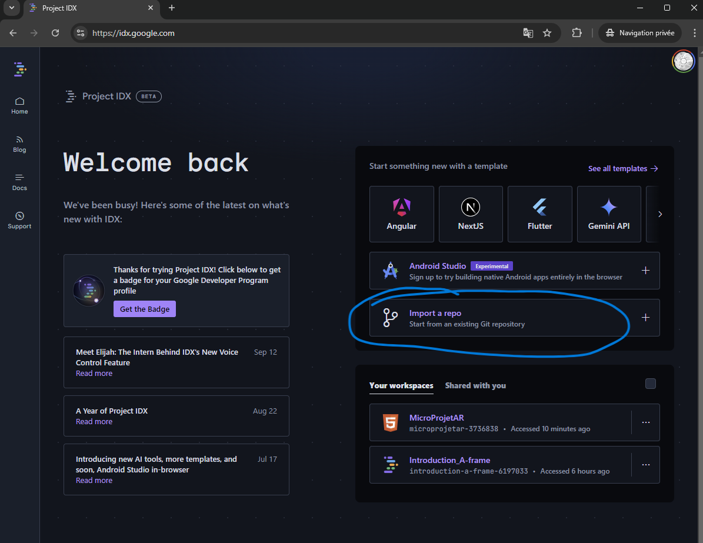
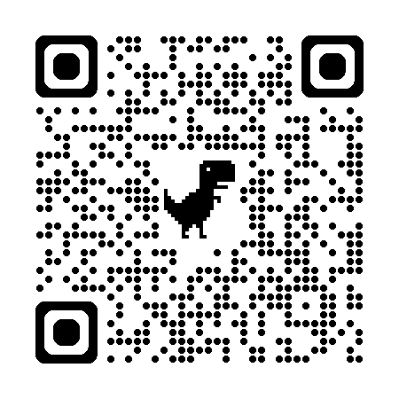
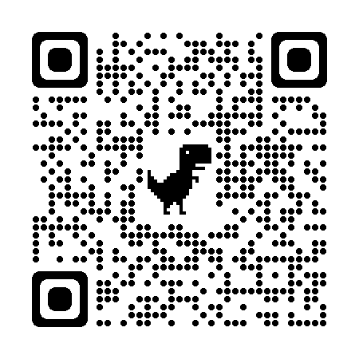
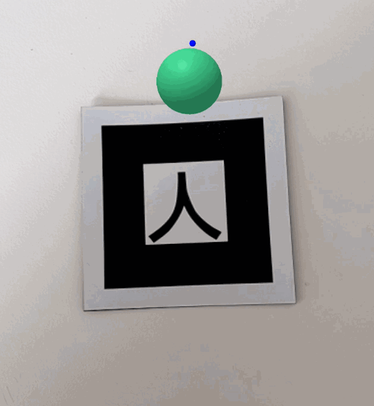
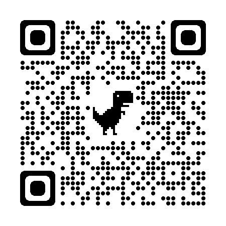

# Introduction_A-frame

Code for a creative coding class on A-Frame for designers. (AR focused)
This is not meant to be exhaustive and code oriented, the goal is to be able to add content and choose the right tracking method for a specific project.
 


## Contents

You can read **"the tools"** to get acquainted with the techno and stuff we will use to make everything work ie cross-plateform AR web based.

First you have a cookbook style part about the kind of **content** : get the minimal code working to display 3D / videos / text etc. over a basic marker.

Second you have the same kind of cookbook ressource going through the **several types of detections** (makers, barcodes, natural images etc.)

Then you have a more technical part about **animation** of content and finally a part about **interaction** which will require basic skills on A-Frame and a bit of javascript coding. So to dive in both those last part you should a least get acquainted with a basic example of detection using kanji marker and 3D shapes/

Have Fun !

Remember you can always navigate the content hierarchy with the burger menu on github !
 


---
## The tools

We use several tools :
- a web plateform to write our code and test our projects : [ProjectIDX](https://idx.dev/)
- a source versionning plateform to publish and host our final project : [github](https://github.com)
- a library for content / assets  manipulation : [A-Frame](https://aframe.io/)
- a library for marker detection / gps markers in augmented reality : [ARjs](https://ar-js-org.github.io/AR.js-Docs/) 
- a library for image / face detection : [MindAR](https://hiukim.github.io/mind-ar-js-doc/)
- a library for marker less (ground, walls etc) detection : [modelViewer](https://modelviewer.dev/)

Note : we used replit at a time instead of github and projectIDX. 
- replit was good, easy and free, but it's not free anymore.
- using github let us own our code and its distribution.
- projectIDX is a better code editor and let us do all what we need.
You will sometime find link that will send you to replit to see the code, how it is structured etc.

[**home**](#Contents)

### What is A-Frame ?
[A-Frame](https://aframe.io/docs/1.2.0/introduction/) is a free and open-source framework supported by the mozilla foundation aiming at easing the creation of 3D / VR / AR experiences in the browser. 

With this this tool it's pretty easy to use the html syntax to create 3D scenes that can then be used in any of the contexts mentionned above.

For instance this code :

```html
<html>
  <head>
    <script src="https://aframe.io/releases/1.2.0/aframe.min.js"></script>
  </head>
  <body>
    <a-scene>
      <a-box position="-1 0.5 -3" rotation="0 45 0" color="#4CC3D9"></a-box>
      <a-sphere position="0 1.25 -5" radius="1.25" color="#EF2D5E"></a-sphere>
      <a-cylinder position="1 0.75 -3" radius="0.5" height="1.5" color="#FFC65D"></a-cylinder>
      <a-plane position="0 0 -4" rotation="-90 0 0" width="4" height="4" color="#7BC8A4"></a-plane>
      <a-sky color="#ECECEC"></a-sky>
    </a-scene>
  </body>
</html>

```

Creates a scene with a sky, a floor (or plane) and 3 3D primitives (a box, a sphere and a cylinder); each element has **attributes** to specify their *position*, *rotation*, *color* etc.

<br>

The live result can be seen here : https://glitch.com/~aframe

Notice that by *clicking and dragging the mouse around* you can change your point of view, and you can even move around using you keyboard with the keys QZSD. Everything is handle behind the scenes for you.

FYI the rendering engine behind A-Frame is [Threejs](https://threejs.org/), and for advanced usage you can have access to it through code.

[**home**](#Contents)

### What is AR ?

AR is a technology that allows you to overlay digital / interactive content on a real world image in real-time. The idea is to augment our vision of the physical world with new information, graphics etc.

Well to be clear the AR world is globally a mess, in this course we choose to focus on web technologies that do work both on desktop, iOS and android to simplify the overall process and experimentations - and we also use free and open source tools.

To do that several method are use to pin / anchor the content :
- **markers detection** : you need to use a specific image to detect its position in a video feed and place content onto it. **ARjs**
- **image detection** : you can train a specific image of your choice to be a marker. You'll need to take a few steps though to make your program recognize your image; be aware that tracking quality will be dependent on the image you choose. **mindAR**
- **marker less detection** : you can detect planes in your environment that is to say : the floor, the ceilling and the walls. Though this technology is not really easily available with free and open source web technologies yet. **modelViewer** can work well in many use cases. Aframe does support this aswell.
- **gps coordinates** : you can pin some contents to a specific gps position, but this is highly experimental at the moment and tracking is a bit shaky. **Arjs**
- **face detection** : you can detect the presence of a face in an image and then pin content onto it. **mindAR**


ARjs is a javascript library to create AR application, it allows you to track the position of markers / images and even gps coordinates.

While ARjs is the library we will use for markers and gps coordinates that is to say most use cases - we will use another one for natural images detection [mindARjs](https://hiukim.github.io/mind-ar-js-doc/quick-start/overview/)


Do keep in mind that tracking is performant when you use markers, like this one - **hiro** :

<br>

Tracking images is more challenging and you need to train an algorithm to do it and the tracking quality highly depends on the image you choose.

But just to give you an idea on how we will do all this, it's still pretty easy - check out this code :

```html
<script src="https://aframe.io/releases/0.8.0/aframe.min.js"></script>
<script src="https://cdn.rawgit.com/jeromeetienne/AR.js/1.6.0/aframe/build/aframe-ar.js"></script>
<body style='margin : 0px; overflow: hidden;'>
	<a-scene embedded arjs='sourceType: webcam;'>
		<a-box position='0 0.5 0' material='opacity: 0.5;'></a-box>
		<a-marker-camera preset='hiro'></a-marker-camera>
	</a-scene>
</body>
```

from this [article](https://medium.com/arjs/augmented-reality-in-10-lines-of-html-4e193ea9fdbf)

Try opening this qr code with your phone and show it the hiro marker above.

<br>

[**home**](#Contents)


### What is projectIDX ?

ProjectIDX is the plateform we will use to write code online and host our project while in development and testing.

You'll need to create an account onto it to code.

When you are logged in and have an example open it looks like this :

<br>

On the left pannel you cand find your files.
The center pannel is dedicated to code edition.
The right pannel is you app live with below the console to track infos and errors.

On the top right corner you have a small button (right next to the adress bar) to open your program in a seperate window in fullscreen. There is another button (with the link icon) to open a qrcode and help test on your phone.

[**home**](#Contents)


---
# The Setup

https://github.com/user-attachments/assets/055da2fd-e9d5-4112-8c46-b86da93d4fae


## The technical setup
The technical setup will help you setup github, projectIDX so that they can work together.

**This part is not optional since it's the way you will make you project public ie accessible to everyone**

### Setup github and github pages
Github will host our files and changes to it. In the end our web app will be served by github hosting services.

You'll be guided to setup github pages to host your own website.


#### Step 1 : Create a GitHub account and repository
- *Create a GitHub account* : If you don't already have one, go to https://github.com/signup?source=login and create an account.

**☢️ The username you choose will be used for the address that needs to be typed in to see your project. <u>Choose a short name! no spaces, no special characters (accents etc.)</u>**

<div align="center"> 
  
  
</div>

- *Create a new repository* : Once you have logged in, click on the "New repository" button. Give your repository a name (for example, "microProjetAr"), add an optional description, and click on "Create repository".

<div align="center"> 

</div>
</br>
<div align="center"> 

</div>

#### Step 2: Activate GitHub Pages
We're now going to configure GitHub Pages to allow our project to be served by the github servers when we enter the address: https://[your-user-name].github.io/[your-depot].

- *Access the settings* : In your repository, click on the "Settings" tab, then on the "Pages" tab.

<div align="center"> 

</div>
</br>
<div align="center"> 

</div>

- *Select the branch*: In the "GitHub Pages" section, select the main branch (or the main branch of your repository) 

- *Save the changes*: Click the "Save" button. Your GitHub Pages site will now be accessible at https://[your-user-name].github.io/[microprojetAr].

<div align="center"> 

</div>

If you return to your project home page, you'll notice after a few minutes that some elements have changed. A deployment is now available!

<div align="center"> 

</div>

So all the infrastructure you need to host your project is in place, all you need to do now is add content.

### Setup projectIDX with github
ProjectIDX is our primary tool, when we work on our project we will mostly be facing their interface. It's where we write the code and test.

We will give it access to our github account to be able to **push** our changes in production (accessible to everyone) after testing them.

Go to the [projectIDX] website (https://idx.dev/) and sign in / log in.

#### Step 1 : import github repo in projectIDX

*Import repository* : Use this option to import your GitHub repository into Project IDX.

<div align="center"> 

</div>

Copy the address of the repository you created earlier.
<div align="center"> 

</div>

#### Step 2 : configure projectIDX for web development
*Configuring the project for web development use.*

- Create an ".idx" folder :
  <div align="center"> 
  
  </div>

- In this folder, create a file called "dev.nix".  
  <div align="center"> 
  
  </div>
  To achieve this result :
  <div align="center"> 
  
  </div>

- Copy the development environment configuration code into the "dev.nix" file you have just created. (This file will enable us to test our code directly in projetIDX and also to test it on our phone).

  ```
  # To learn more about how to use Nix to configure your environment
  # see: https://developers.google.com/idx/guides/customize-idx-env
  { pkgs, ... }: {
    # Which nixpkgs channel to use.
    channel = "stable-23.11"; # or "unstable"
    # Use https://search.nixos.org/packages to find packages
    packages = [
      pkgs.nodejs_20
      pkgs.python3
    ];
    # Sets environment variables in the workspace
    env = {};
    idx = {
      # Search for the extensions you want on https://open-vsx.org/ and use   "publisher.id"
      extensions = [
        # "vscodevim.vim"
      ];
      # Enable previews and customize configuration
      previews = {
        enable = true;
        previews = {
          web = {
            command = ["python3" "-m" "http.server" "$PORT" "--bind" "0.0.0.0"];
            manager = "web";
          };
        };
      };
      # Workspace lifecycle hooks
      workspace = {
        # Runs when a workspace is first created
        onCreate = {
          # Example: install JS dependencies from NPM
          # npm-install = "npm install";
          # Open editors for the following files by default, if they exist:
          default.openFiles = [ "style.css" "main.js" "index.html" ];
        };
        # Runs when the workspace is (re)started
        onStart = {
          # Example: start a background task to watch and re-build backend code
          # watch-backend = "npm run watch-backend";
        };
      };
    };
  }
  ```
Your working environment should look like this:
   
  <div align="center"> 
  
  </div>

All you have to do is click on the "Rebuild Environment" button and you're done!


#### Step 3 : Creating the HTML page

Create an index.html file: In your IDX project, create a file called **"index.html. "**.

<div align="center"> 

</div>


Add the HTML code: Copy and paste the following HTML code into your index.html file:

```HTML
<!doctype html>
<html>

<head>
  <title>My first ar experience </title>
	<script src="https://aframe.io/releases/1.3.0/aframe.min.js">
	</script>
	<script src="https://raw.githack.com/AR-js-org/AR.js/3.4.5/aframe/build/aframe-ar.js">

	</script>
</head>


<body style="margin : 0px; overflow: hidden;">

	<a-scene 
    embedded arjs="sourceType: webcam;"
    vr-mode-ui="enabled: false" 
    renderer="sortObjects: true; antialias: true; logarithmicDepthBuffer: true;"
    arjs="trackingMethod: best;
    detectionMode :'color_and_matrix' 
    changeMatrixMode: 'modelViewMatrix'; "
	  smooth="true" smoothCount="5" smoothTolerance=".05" smoothThreshold="5" 
    sourceWidth= "800" sourceHeight= "600"
    displayWidth= "1280" displayHeight="720" >

		<a-marker preset="kanji" size= "0.08">

			<a-box position='0 0 0' rotation='0 0 0' scale='1 1 1' color='#FD5D3B' material='opacity: 1;'></a-box>

		</a-marker>

		<a-camera position="0 0 0" look-controls="enabled: false"></a-camera>

	</a-scene>

</body>

</html>
```

#### Step 4 : Understand the code

This code creates a simple augmented reality (AR) experience using A-Frame and AR.js. Let's break down what each part does:

If you are unfamiliar with how html code works, click on the small triangle to unfold an explanation of the basics of html syntax.

<details > <summary> <b>&#128161 html basics</b> </summary>

An HTML page is like a sandwich. It needs a top bun and a bottom bun to hold the filling!

The top and bottom breadcrumbs are the ```<html>``` and ```</html>``` tags. They tell the browser that the content between these tags is HTML code.

Two main parts: Inside the "HTML sandwich", there are two parts:

**The head** (```<head>``` and ```</head>```): This is like the information on a sandwich wrapper. It contains information that is important for the browser, but which is not displayed directly to the user. 

For example:

- The page title ```<title>```

- Links to CSS files for styling

- Links to JavaScript files for interactive features

**The body** (```<body>``` and ```</body>```): This is the filling in the sandwich! It is the visible content of the web page: text, images, videos, etc.

The syntax and therefore the interpretation of html code by the browser is based on opening and closing tags:

- The **opening** tag (for example ```<p>```)  tells the navigator: "Watch out, we're starting a paragraph!"

- The **closing** tag (for example ```</p>```) says: "That's it, the paragraph is finished".

All content between the opening tag and the closing tag is considered to be part of this element.

Exemple :
```html
<html>
<head>
  <title>My web page</title>
</head>
<body>
  <h1>Welcome !</h1>
  <p>This is a paragraph</p>
</body>
</html>
```
In this example :

- ```<html>``` opens the HTML page and ```</html>``` closes it.
- ```<head>``` opens the header section and ```</head>``` closes it.
- ```<title>``` opens the page title and ```</title>``` closes it.
- ```<body>``` opens the body of the page and ```</body>``` closes it.
- ```<h1>``` opens a level 1 heading and ```</h1>``` closes it.
- ```<p>``` opens a paragraph and ```</p>``` closes it.

</details>
</br>

Here we have a classic HTML structure: The code sets up a basic HTML page with <head> and <body> sections.

In the ```<head>``` part, we add : 

- the title of the experience
  ```html
  <title>My first AR app</title>
  ```

- the A-Frame Library: It includes the A-Frame library (aframe.min.js), a JavaScript framework for creating virtual reality (VR) and AR experiences using HTML.

  ```html
  <script src="https://aframe.io/releases/1.3.0/aframe.min.js"></script>
  ``` 

- the *AR.js library*: It includes the AR.js library (aframe-ar.js) which adds AR capabilities to A-Frame.

  ```html
  <script src="https://raw.githubusercontent.com/jeromeetienne/AR.js/master/aframe/build/aframe-ar.js"></script>  
  ```

In the```<body>```, and this is where everything comes into play for the content visible to the user. We add : 

- the *RA stage* : The element ```<a-scene>``` creates the RA scene.
  ```html
  <a-scene embedded
    arjs="sourceType: webcam; detectionMode: mono_and_matrix; matrixCodeType: 3x3; trackingMethod: best ; changeMatrixMode: modelViewMatrix;"
    renderer="sortObjects: true; antialias: true; logarithmicDepthBuffer: true;"

    vr-mode-ui="enabled: false"

    smooth=" true" smoothCount="5" smoothTolerance=".05" smoothThreshold="5"
    
    sourceWidth="800" sourceHeight="600" displayWidth="1280" displayHeight="720">

        <!-- contenu de l'expérience AR avec d'autres balises -->

  </a-scene>
  ```

  Note that before the closing chevron '>' in the ```<a-scene>``` we add a lot of options (called attributes in html) to configure the way the scene is displayed.


- The *marker* : The tag ```<a-marker>``` defines what type of marker we use (here it's the default kanji marker) When the camera detects this marker, the content inside the tag will be displayed in AR.
  ```html
  <a-marker preset="kanji" size= "0.08">
    <!-- add content that will be visible to the user and therefore anchored on our marker, can be a cube, an image etc. -->
  </a-marker>
  ```

- A box : The element <a-box> creates a 3D box that will be displayed on top of the kanji marker.
  ```html
  <a-box position='0 0 0' rotation='0 0 0' scale='1 1 1' color='#FD5D3B' material='opacity: 1;'></a-box>
  
  ```


- Camera : L'élément ```<a-camera>``` defines the camera in the scene, we're perfectly happy with the way it works by default, but it's possible to add features such as gaze interaction.


To sumup, this code creates an AR experience where an orange box appears in a 3D spce when the marker 'kanji' is detected by the camera.


#### Step 5 : Test

- Save changes : Save your index.html file.

- Test your project : Display the webview of your project.

  <div align="center"> 
  
  </div>

  **☣️** It may happen that the webview disappears... In this case you can bring up the "command palette" by (Cmd+Shift+P on Mac or Ctrl+Shift+P for other systems), then select or type "Show Web Preview".

  <div align="center"> 
  
  </div>

  You can then view your page full screen by clicking on the small icon at the top right.

  <div align="center"> 
  
  </div>

  This will open your experience in a new tab on your computer. At this point you should see: a web page showing you!


You can run it live at [this adress :](https://b2renger.github.io/Introduction_A-frame/code_examples/00AFrameARboilerplate/)

or scan this qr code  and show it kanji !


</br>


Now that we have covered the tools, we will see what kind of content we can add and then, we will try several detections methods

Most of the time you will be able to copy and paste code from the examples in this course, beware of the assets that may be needed (3D models, images, etc.)

[**home**](#Contents)

Notes :
You can open the A-Frame scene inspector by using the shortcut : "ctrl" + "alt" + "i".

---
## Several kinds of contents

Let's get started and see how we can add some content in AR to a simple hiro marker. For all content we will refer to the [A-Frame documentation](https://aframe.io/docs/1.2.0/introduction/) : if you scroll at the **bottom of the left hand side menu** you will find links to the documentation of many primitives you can add to your scene.

</br>

With those lets create our first 3D scene !

[**home**](#Contents)

### Basic shapes

#### Getting started

A-Frame has a lot of elements you can draw directly on your scene : all the basic 3D shapes you could imagine : 

- [boxes](https://aframe.io/docs/1.2.0/primitives/a-box.html)
- [circles](https://aframe.io/docs/1.2.0/primitives/a-circle.html)
- [cones](https://aframe.io/docs/1.2.0/primitives/a-cone.html)
- [cylinders](https://aframe.io/docs/1.2.0/primitives/a-cylinder.html)
- [dodecahedron](https://aframe.io/docs/1.2.0/primitives/a-dodecahedron.html)
- [icosahedron](https://aframe.io/docs/1.2.0/primitives/a-icosahedron.html)
- [octahedron](https://aframe.io/docs/1.2.0/primitives/a-octahedron.html)
- [plane](https://aframe.io/docs/1.2.0/primitives/a-plane.html)
- [ring](https://aframe.io/docs/1.2.0/primitives/a-ring.html)
- [sphere](https://aframe.io/docs/1.2.0/primitives/a-sphere.html)
- [tetrahedron](https://aframe.io/docs/1.2.0/primitives/a-tetrahedron.html)
- [torus-knot](https://aframe.io/docs/1.2.0/primitives/a-torus-knot.html)
- [torus](https://aframe.io/docs/1.2.0/primitives/a-torus.html)
- [triangle](https://aframe.io/docs/1.2.0/primitives/a-triangle.html)

Considering the boilerplate code we've seen it can be pretty easy to build a scene by placing, rotating, scaling etc several shapes in place.

A-Frame also has some [lights](https://aframe.io/docs/1.3.0/components/light.html#sidebar) and also supports realtime [shadows](https://aframe.io/docs/1.2.0/components/shadow.html)

Consider the following code with a few objects placed in a 3D space onto a maker : 


<details>
<summary> Code </summary>

```html
<!doctype html>
<html>

<head>
	<script src="https://aframe.io/releases/1.3.0/aframe.min.js">

	</script>
	<script src="https://raw.githack.com/AR-js-org/AR.js/3.4.5/aframe/build/aframe-ar.js">

	</script>
</head>


<body style="margin : 0px; overflow: hidden;">

		<a-scene 
    embedded arjs="sourceType: webcam;"
    vr-mode-ui="enabled: false" 
    renderer="sortObjects: true; antialias: true; logarithmicDepthBuffer: true;"
    arjs="trackingMethod: best"
    detectionMode= 'color_and_matrix' 
    changeMatrixMode= "modelViewMatrix" 
	  smooth="true" smoothCount="5" smoothTolerance=".05" smoothThreshold="5" 
    sourceWidth= "800" sourceHeight= "600"
    displayWidth= "1280" displayHeight="720"
    shadow="autoUpdate: true; enabled: true; type:pcf"
    light="defaultLightsEnabled: false"
     >

       
    
  
		<a-marker  preset="kanji" size= "0.8">
      
      <a-light type="spot" castShadow="true" color="white" position="-1 10 3" rotation="0 0 0" target="#directionaltarget"></a-light>
 
      <a-entity id="directionaltarget" position="0 0 0"></a-entity>
      

			<a-box position='0 .8 0' rotation='0 0 0' scale='1 1 1' color='#5800FF' material='opacity: 1;'shadow="receive: true; cast:true" ></a-box>

      <a-dodecahedron position='-1.25 .8 0' color="#E900FF" radius=".5" shadow="receive: true; cast:true" ></a-dodecahedron>

      <a-torus-knot position='1.25 .8 0' rotation='90 90 0' color="#FFC600" arc="180" p="2" q="7" radius=".25" radius-tubular="0.01" shadow="receive: true; cast:true"></a-torus-knot>

      <a-plane position='0 0 0' rotation="-90 0 0" width="4" height="4" color='#FFFFFF' side="double"  shadow="receive: true; cast:true"></a-plane>
     

		</a-marker>

		<a-camera position="0 0 0" look-controls="enabled: false"></a-camera>

	</a-scene>

</body>

</html>
```

</details>


You can run it live at [this adress :](https://b2renger.github.io/Introduction_A-frame/code_examples/01AFrameARShapes/)

or scan this qr code  and show it kanji !


</br>


[**home**](#Contents)

#### Mixins and texturing

As you get more confortable using primitives, one technique can be usefull to create more re-usable components and allow you to diminish the amount of code you have to type in to get a proper scene running; so let's learn about the [mixins](https://aframe.io/docs/1.2.0/core/mixins.html) !

A **mixin** is basically a way to define an element to be reused later on when building a scene. We can define colors, shapes etc.

A mixin is defined in between **a-assets** tags and uses **a-mixin**. One important point is to give an id to each mixin. This id will be used to recall the shapes or colors we defined.

```html
 <a-assets>
    <!-- define some colors -->
    <a-mixin id="green" material="color: green"></a-mixin>
    <a-mixin id="brown" material="color: brown"></a-mixin>
    <a-mixin id="darkbrown" material="color:#7e5835 "></a-mixin>
    <a-mixin id="lightgreen" material="color:#a5d152 "></a-mixin>
    <!-- define some geometries -->
    <a-mixin id="trunk" geometry="primitive: box ; width:.25; height:1; depth:.25"></a-mixin>
    <a-mixin id="treetop" geometry="primitive: cone ; radius-bottom:.5; radius-top:0"></a-mixin>
    <a-mixin id="othertreetop" geometry="primitive: dodecahedron ; radius:.75"></a-mixin>
  </a-assets>
  ```

Now in our scene we can build objects based on those mixins :

- brown trunk and green treetop
```html
<a-entity mixin="brown trunk" position = "0 .5 0"></a-entity>
<a-entity mixin="green treetop" position = "0 1.5 0"></a-entity>
```

- or a darkbrown trunk and a lightgreen othertreetop
```html
<a-entity mixin="darkbrown trunk" position = "-1.25 .5 0" ></a-entity>
<a-entity mixin="lightgreen othertreetop" position = "-1.25 1.5 0"></a-entity>
```

Let's now texture a plane that will represent a ground. The textures should be added as [materials](https://aframe.io/docs/1.2.0/components/material.html). A material can be as simple as a color or it can also be a texture (or image), and if you know about 3D, you can also add some maps like normal map, displacement map, or AO map.

For our examples we will use textures from this [link](https://polyhaven.com/a/forest_leaves_02) - (btw [polyhaven](https://polyhaven.com) is awesome !)

First you need to load your image into replit you can just drag and drop it onto the 'assets' folder. If the folder does not exist : you can create one. Then in the assets part of our programm you can import it:

```html

```

Then in the **a-plane** object (or in any entity) you can set the **src** for the **material** like this :

```html
<a-plane position='0 0 0' rotation="-90 0 0" width="4" height="4" material="src: #leavestex;"></a-plane>
```

You can also add normal or displacement map to any object, but be sure if you use a displacement map to have some vertices to displace. You can setup the subdivision of your plane with *segments-height* and *segments-width*.


You can have a look at the code here :

<details>
    <summary>Code</summary>

```html
<!doctype html>
<html>

<head>
	<script src="https://aframe.io/releases/1.3.0/aframe.min.js">

	</script>
	<script src="https://raw.githack.com/AR-js-org/AR.js/3.4.5/aframe/build/aframe-ar.js">

	</script>
</head>


<body style="margin : 0px; overflow: hidden;">

	<a-scene 
    embedded arjs="sourceType: webcam;"
    vr-mode-ui="enabled: false" 
    renderer="sortObjects: true; antialias: true; logarithmicDepthBuffer: true;"
    arjs="trackingMethod: best"
    detectionMode= "color_and_matrix"
    changeMatrixMode= "modelViewMatrix" 
	  smooth="true" smoothCount="5" smoothTolerance=".05" smoothThreshold="5" 
    sourceWidth= "800" sourceHeight= "600" 
    displayWidth= "1280" displayHeight="720"
    shadow="autoUpdate: true; enabled: true; type:pcf"
    light="defaultLightsEnabled: false"
     >

  <a-assets>
    <!-- define some colors -->
    <a-mixin id="green" material="color: green"></a-mixin>
    <a-mixin id="brown" material="color: brown"></a-mixin>
    <a-mixin id="darkbrown" material="color:#7e5835 "></a-mixin>
    <a-mixin id="lightgreen" material="color:#a5d152 "></a-mixin>
    <!-- define some geometries -->
    <a-mixin id="trunk" geometry="primitive: box ; width:.25; height:1; depth:.25"></a-mixin>
    <a-mixin id="treetop" geometry="primitive: cone ; radius-bottom:.5; radius-top:0"></a-mixin>
    <a-mixin id="othertreetop" geometry="primitive: dodecahedron ; radius:.75"></a-mixin>
    <!-- load some textures-->
    
    
    


  </a-assets>
       
    
  
		<a-marker  preset="kanji" size="0.8">

      
      <a-light type="spot" castShadow="true" color="white" intensity="2" position="-1 5 2"  target="#directionaltarget"></a-light>
      <a-entity id="directionaltarget" position="0 0 0"></a-entity>
      
      <a-entity mixin="brown trunk" position = "0 .5 0"></a-entity>
      <a-entity mixin="green treetop" position = "0 1.5 0"></a-entity>

      <a-entity mixin="darkbrown trunk" position = "1.25 .5 0" geometry="height:1.5"></a-entity>
      <a-entity mixin="lightgreen treetop" position = "1.25 2 0" geometry="height:1.5"></a-entity>

      <a-entity mixin="darkbrown trunk" position = "-1.25 .5 0" ></a-entity>
      <a-entity mixin="lightgreen othertreetop" position = "-1.25 1.5 0"></a-entity>


      <a-plane position='0 0 0' rotation="-90 0 0" width="4" height="4"
       segments-height="100" segments-width="100"
      material="src: #leavestex; normalMap:#leavesnorm;displacementMap:#leavesdisp; displacementBias:-0.5; displacementScale:1" shadow="receive: true; cast:true"></a-plane>

     

		</a-marker>

		<a-camera position="0 0 0" look-controls="enabled: false"></a-camera>

	</a-scene>

</body>

</html>

```
</details>


You can run it live at [this adress :](https://b2renger.github.io/Introduction_A-frame/code_examples/02AFrameARShapesmixins/)

or scan this qr code  and show it kanji !


</br>

You can find the code on replit here to see how it is structured and help you reproduce it in projectIDX
https://replit.com/@b2renger/02AFrameARShapesmixins#index.html

Note that you need texture images to reproduce this example in projectIDX. You can find them in the release section of the github repo

If you want to know more about textures maps and pbr material you can have look here : https://medium.com/@kfarr/experimenting-with-pbr-textures-and-a-frame-26c5a034b7b


[**home**](#Contents)


### Images

Putting images in ar experiences is pretty straight forward. We will use the same kind of code as before.

First you need to load your image into projectIDX you can just drag and drop it onto the 'assets' folder. 


Then in the assets part of our programm you can import it:

```html
<a-assets>
  
</a-assets> 
```

Then we will use the **"a-image"** tag to display it on the marker :

```html
<a-marker  preset="kanji" size="0.8">
  <a-image src="#transparent_image" rotation="90 0 0" width="2" height="2"></a-image>
</a-marker>
```
Easy !

The important part is to understand how the image is linked from the assets to the specific tag. For that we use the *id* in the assets that should match the *src* in the "a-image" tag.


You can have a look at the code here :

<details>
    <summary>Code</summary>

```html
<!doctype html>
<html>

<head>
	<script src="https://aframe.io/releases/1.3.0/aframe.min.js">

	</script>
	<script src="https://raw.githack.com/AR-js-org/AR.js/3.4.5/aframe/build/aframe-ar.js">

	</script>
</head>


<body style="margin : 0px; overflow: hidden;">
	<a-scene 
    embedded arjs="sourceType: webcam;"
    vr-mode-ui="enabled: false" 
    renderer="sortObjects: true; antialias: true;  logarithmicDepthBuffer: true;"
    arjs="trackingMethod: best"
    detectionMode= 'color_and_matrix' 
    changeMatrixMode= "modelViewMatrix" 
	  smooth="true" smoothCount="5" smoothTolerance=".05" smoothThreshold="5" 
    sourceWidth= "800" sourceHeight= "600"
    displayWidth= "1280" displayHeight="720"
    shadow="autoUpdate: true; enabled: true; type:pcf"
    light="defaultLightsEnabled: false"
     >

  <a-assets>
    
  </a-assets>
       
    
  
	<a-marker  preset="kanji" size="0.8">
    <a-image src="#transparent_image" rotation="90 0 0" width="2" height="2"></a-image>
	</a-marker>

	<a-camera position="0 0 0" look-controls="enabled: false"></a-camera>

	</a-scene>

</body>

</html>

```

</details>

You can run it live at [this adress :](https://b2renger.github.io/Introduction_A-frame/code_examples/03AFRAMEARImages/)

or scan this qr code  and show it kanji !


</br>

You can find the code on replit here to see how it is structured and help you reproduce it in projectIDX
https://replit.com/@b2renger/03AFRAMEARImages#index.html

Note you will need an image to put in your asset folder.

[**home**](#Contents)

### Audio
The first example aims at **playing a sound when a marker is on sight** ! (thank you @zhakk-harn)


The breakdown of this example goes like this :

In the head of our page we defer a script which is a component to play audio :
```js
<script defer>
    AFRAME.registerComponent("audiohandler", {
      init: function () {
        this.trackedElements = document.querySelectorAll(
          "a-marker[audiohandler]"
        );
      },
      tick: function () {
        this.trackedElements.forEach((marker) => {
       
          const sound = document.querySelector(
            marker.attributes.audioReference.value
          );
          if (marker.object3D.visible) {
           
            if (sound.paused) {
              sound.play();
            }
          } else {
        
            if (!sound.paused) {
              sound.pause();
              sound.currentTime = 0;
            }
          }
        });
      },
    });
  </script>
```
The component is a tiny bit of code we attach to a tag, that will run all the time.

Basically this component loads a sound file that is given as an attribute to a marker tag. At every frame calculated we check if the marker is visible, if it's visible and the sound is paused we play the sound - if the marker is not visible and the sound is not paused we pause it and we reset it.

Then we can load assets :
```html
  <a-assets>
    <audio id="sound1" src="assets/634332__josefpres__bass-loops-077-with-drums-long-loop-120-bpm.mp3" preload="auto"></audio>
  </a-assets>
```

And finally call the script on our maker with the reference of the audio file :

```html
  <a-marker audiohandler audioReference="#sound1"  preset="kanji" size="0.8"></a-marker>
```

You can run it live at [this adress :](https://b2renger.github.io/Introduction_A-frame/code_examples/14AFRAMEARAudio/)

or scan this qr code  and show it kanji !


</br>

You can find the code on replit at this adress :
https://replit.com/@b2renger/14AFRAMEARAudio#index.html

Note : you'll need audio files to experiments with this.

An extra example will help you to **play a sound on a "cursor-click"**, it's more advanced and you'll need to read the *interaction* part of this cook book to understand how "cursors" and "fusing" actually work.
https://replit.com/@b2renger/14AFramegaze2audio


[**home**](#Contents)

### Videos

Videos are a complicated subject on the web. Most browsers try to prevent you from auto-playing videos.

Then videos are cool but we would like to also be able to play videos with a transparent background.

Well it is possible, not easy but possible : 
- Safari supports HEVC with alpha, Chrome does not.
- Chrome supports VP9 with alpha, Safari does not.

That's why in the end I wrote a full component to handle videos. It will :
- load a video
- display it
- if you click on the screen it will force the play function of the video
- it has a mode called **chromakey** to be able to remove a specific color from the video and turn it to transparent pixels. That means that if you export a video with a solid green background you can replace the green with transparent pixels.

It works like this :
- load a video in the assets tag (like images etc.) - with a bunch of options
- in the marker tag we will create an entity
  - this entity will display a geometry (a plane)
  - this plane will have a material which has been coded to display the video
- this custom code actually accepts parameters : like is chromakey enabled or not and on what color is it active.

Be aware that this technique does not play the audio contained in the video. If you want to play both audio and video, read through this section, there is an example at the end to combine the audio script and this video example.

So loading the video in the assets tag looks like this :

```html
   <a-assets>
      <video id="vid" src="assets/mask_blue_sil.mp4" autoplay="true" loop="true" preload="auto" controls="true"
        muted="true" playsinline="" webkit-playsinline=""></video>
    </a-assets>
```

The marker tag with the entity looks like this :
```html
    <a-marker preset="kanji" size="0.8">
      <a-entity material="shader: chromakey; src: #vid; chroma: true; color: 0. 0. 1."
        geometry="primitive: plane; width:  1; height:  1" position="0  0  0" rotation="270  0  0" side="double">
      </a-entity>
      <a-text value="Click Me !" scale='1 1 1' position='-0.4 0 0'></a-text>
    </a-marker>
```

Have a look at the "material" parameter from the entity tag :
- it specifies to run a specific component called "chromakey"
- the source (**src**) of the video displayed is the one with the id *#vid* - the same we used in our assets.
- the **chroma** parameter is set to *true* - that means that we will remove a color from the video => set it to false if you just want the video unaltered
- the **color** parameter lets you specify what color you want to remove in rgb every value between 0.0 and 1.0

In the "geometry" you can change the "width" and "height" of your plane to your desired aspect ratio.

The full code of the component look like this. You can copy / paste it in any "head" tag of a project
```js
 <script defer>
    // https://github.com/nikolaiwarner/aframe-chromakey-material
    AFRAME.registerShader('chromakey', {
      schema: {
        src: {type: 'map'},
        color: {default: {x: 0.0, y: 1.0, z: 0.0}, type: 'vec3', is: 'uniform'},
        chroma: {type: 'bool', is: 'uniform'},
        transparent: {default: true, is: 'uniform'}
      },

      init: function (data) {
        const videoEl = data.src;
        document.addEventListener('click', () => {
          videoEl.play();

          this.el.children[0].setAttribute('visible', false)
          //console.log(this.el.children)
        });

        var videoTexture = new THREE.VideoTexture(data.src)
        videoTexture.minFilter = THREE.LinearFilter
        this.material = new THREE.ShaderMaterial({
          uniforms: {
            chroma: {
              type: 'b',
              value: data.chroma
            },
            color: {
              type: 'c',
              value: data.color
            },
            myTexture: {
              type: 't',
              value: videoTexture
            }
          },
          vertexShader:
            `
            varying vec2 vUv;
            
            void main(void)
            {
              vUv = uv;
              vec4 mvPosition = modelViewMatrix * vec4( position, 1.0 );
              gl_Position = projectionMatrix * mvPosition;
            }
          `
          ,
          fragmentShader:
            `
              uniform sampler2D myTexture;
              uniform vec3 color;
              uniform bool chroma;
              varying vec2 vUv;
              
              void main(void)
              {
                vec3 tColor = texture2D( myTexture, vUv ).rgb;
                float a;
                if(chroma == true){
                   a = (length(tColor - color) - 0.5) * 7.0;
                }
                else {
                  a = 1.0;
                }
                
                gl_FragColor = vec4(tColor, a);
              }
            `
        })
      },

      update: function (data) {
        this.material.color = data.color
        this.material.src = data.src
        this.material.transparent = data.transparent
      },

    })

  </script>
```

</br>

You can run it live at [this adress :](
https://b2renger.github.io/Introduction_A-frame/code_examples/04AFRAMEARVideosgreenscreenshader/)


or scan this qr code and show it kanji ! (if nothing happens click on the screen to launch the video)


</br>


You can have a look at the whole example here :
https://replit.com/@b2renger/04AFRAMEARVideosgreenscreenshader


You want to export mp4 files with h264 codec and a
for your conversion needs [shutter encoder](https://www.shutterencoder.com/en/) is a very good tool.

If you want to play audio with the video, you'll need to have a video (mp4) and an audio file seperated (mp3). Check out this exampl that combines both scripts :
https://replit.com/@b2renger/04AFRAMEARVideosgreenscreenshaderaudio

```html
<!doctype html>
<html>

<head>
  <script src="https://aframe.io/releases/1.3.0/aframe.min.js"></script>
  <script src="https://raw.githack.com/AR-js-org/AR.js/3.4.5/aframe/build/aframe-ar.js"></script>

  <script defer>
    // https://github.com/nikolaiwarner/aframe-chromakey-material
    AFRAME.registerShader('chromakey', {
      schema: {
        src: {type: 'map'},
        color: {default: {x: 0.0, y: 1.0, z: 0.0}, type: 'vec3', is: 'uniform'},
        chroma: {type: 'bool', is: 'uniform'},
        transparent: {default: true, is: 'uniform'}
      },

      init: function (data) {

        const videoEl = data.src;

        document.addEventListener('click', () => {
          videoEl.play();
          const entity = document.querySelector("[sound]");
          if (entity) entity.components.sound.playSound();
        });

        var videoTexture = new THREE.VideoTexture(data.src)
        videoTexture.minFilter = THREE.LinearFilter
        this.material = new THREE.ShaderMaterial({
          uniforms: {
            chroma: {
              type: 'b',
              value: data.chroma
            },
            color: {
              type: 'c',
              value: data.color
            },
            myTexture: {
              type: 't',
              value: videoTexture
            }
          },
          vertexShader:
            `
            varying vec2 vUv;
            
            void main(void)
            {
              vUv = uv;
              vec4 mvPosition = modelViewMatrix * vec4( position, 1.0 );
              gl_Position = projectionMatrix * mvPosition;
            }
          `
          ,
          fragmentShader:
            `
              uniform sampler2D myTexture;
              uniform vec3 color;
              uniform bool chroma;
              varying vec2 vUv;
              
              void main(void)
              {
                vec3 tColor = texture2D( myTexture, vUv ).rgb;
                float a;
                if(chroma == true){
                   a = (length(tColor - color) - 0.5) * 7.0;
                }
                else {
                  a = 1.0;
                }
                
                gl_FragColor = vec4(tColor, a);
              }
            `
        })
      },

      update: function (data) {
        this.material.color = data.color
        this.material.src = data.src
        this.material.transparent = data.transparent
      },
    });
  </script>

  <script defer>
    AFRAME.registerComponent("audiohandler", {
      init: function () {
        this.trackedElements = document.querySelectorAll(
          "a-marker[audiohandler]"
        );
        // console.log(this.trackedElements);
      },
      tick: function () {
        this.trackedElements.forEach((marker) => {
          const vid = document.querySelector(
            marker.attributes.vidReference.value
          );
          const sound = document.querySelector(
            marker.attributes.audioReference.value
          );
          if (marker.object3D.visible) {
            if (vid && vid.paused) {
              vid.play();
            }
            if (sound && sound.paused) {
              sound.play();
            }
          } else {
            if (vid && !vid.paused) {
              vid.pause();
              vid.currentTime = 0;
            }
            if (sound && !sound.paused) {
              sound.pause();
              sound.currentTime = 0;
            }
          }
        });
      },
    });

  </script>
</head>

<body style="margin : 0px; overflow: hidden;">

  <a-scene embedded arjs="sourceType: webcam;" vr-mode-ui="enabled: false"
    renderer="sortObjects: true; antialias: true; colorManagement: false; physicallyCorrectLights; logarithmicDepthBuffer: false;"
    arjs="trackingMethod: best; debugUIEnabled: false;">


    <a-assets>
      <video id="vid1" src="assets/mask_red_back.mp4" autoplay="true" loop="true" preload="auto" controls="true"
        muted="true" playsinline="" webkit-playsinline=""></video>
      <audio id="sound1" src="assets/634332__josefpres__bass-loops-077-with-drums-long-loop-120-bpm.mp3" preload="auto"></audio>
    </a-assets>


    <a-marker audiohandler audioReference="#sound1" vidReference="#vid1" preset="kanji" size="0.8">
      <a-entity material="shader: chromakey; src:#vid1; chroma:true; color: 0. 0. 0."
        geometry="primitive: plane; width:  1; height:  1" position="0  0  0" rotation="270  0  0" side="double">
      </a-entity>
    </a-marker>

    <a-camera position="0 0 0" look-controls="enabled: false"></a-camera>

  </a-scene>

</body>

</html>
```


[**home**](#Contents)

### Texts

Text may seem like the most basic component to display, but as a matter of fact it is no that easy fortunately AFrame team and other individual managed to give us good tools and ressources. This is due to the 3D nature of A-Frame and XR technologies. There is a complete documentation on this subject on the website [here](https://aframe.io/docs/1.2.0/components/text.html).

If you want to use basic fonts - the one already available for use - it's relatively easy;  you can probably find a font that will suit you in the stock fonts shipped with A-Frame :
https://aframe.io/docs/1.2.0/components/text.html#stock-fonts

Or on this github : https://github.com/etiennepinchon/aframe-fonts
As the link above actually share 200 fonts from Google fonts already converted for you convenience ! Those fonts are classic fonts converted to the msdf format : which is a json file with the data needed to draw the font in 3D.

The most basic way to display a text would be this line of code (inside a "a-marker" tag of course).
```html
<a-text value="Hello, World!" side="double" position = "0 0 -1" rotation="270 0 0" color="blue" align="center" ></a-text>
```
We do not specify a font file but all the basics features like position, rotation, color, and alignement. The "side" attribute specified to "double" means that the mesh representing the text can be viewed from every angle.

If you want to specify a from the github link above you'll want to use a "a-entity" tag which will give us more options :

```html
<a-entity text="value:Hello Creepster; color:#FFFFFF; 
        width: 4; height: auto; align:center;
        shader: msdf; 
        font:https://raw.githubusercontent.com/etiennepinchon/aframe-fonts/master/fonts/creepster/Creepster-Regular.json;" 
        side="double" rotation="270 0 0" position="0 0 -0.5"></a-entity>  
``` 
in the font attribute you need to link to the json you can find in the arborescence of the github repo. For "Creepster" it is found in the "font" folder the in the "creepster" folder.
 
If you want to use custom fonts it will require several operations beforehand like using a converter to transform a font into a SDF (signed distance function) font or a MSDF (Multi-channel SDF) one with a tool like this one [MSDF font generator](https://msdf-bmfont.donmccurdy.com/).


For a complete example you can look here :


<details>
    <summary>Code</summary>

```html
<!doctype html>
<html>
<head>
	<script src="https://aframe.io/releases/1.3.0/aframe.min.js">

	</script>
	<script src="https://raw.githack.com/AR-js-org/AR.js/3.4.5/aframe/build/aframe-ar.js">

	</script>
</head>


<body style="margin : 0px; overflow: hidden;">

	
	<a-scene 
    embedded arjs="sourceType: webcam;"
    vr-mode-ui="enabled: false" 
    renderer="sortObjects: true; antialias: true; logarithmicDepthBuffer: true;"
    arjs="trackingMethod: best"
    detectionMode= 'color_and_matrix' 
    changeMatrixMode= "modelViewMatrix" 
	  smooth="true" smoothCount="5" smoothTolerance=".05" smoothThreshold="5" 
    sourceWidth= "800" sourceHeight= "600"
    displayWidth= "1280" displayHeight="720"
    shadow="autoUpdate: true; enabled: true; type:pcf"
    light="defaultLightsEnabled: false"
    
     >
    
  
		<a-marker preset="kanji" size= "0.8">
      <!-- basic text : we manually offset the position  -->
      <a-text value="Hello, World!" side="double" position = "0 0 -1" rotation="270 0 0" color="blue" align="center" ></a-text>
     

      <a-entity text="value:Hello Creepster; color:#FFFFFF; 
        width: 4; height: auto; align:center;
        shader: msdf; 
        font:https://raw.githubusercontent.com/etiennepinchon/aframe-fonts/master/fonts/creepster/Creepster-Regular.json;" 
        side="double" rotation="270 0 0" position="0 0 -0.5"></a-entity>   


      <a-entity text="value:Hello Indie Flower; color:red; 
        width: 8; height: auto; align:center;
        shader: msdf; 
        font:https://raw.githubusercontent.com/etiennepinchon/aframe-fonts/master/fonts/indieflower/IndieFlower-Regular.json;" 
        side="double" rotation="270 0 0" position="0 0 0"></a-entity>
      
		</a-marker>

		<a-camera position="0 0 0" look-controls="enabled: false"></a-camera>

	</a-scene>


</body>

</html>

```
</details>


You can run it live with [this adress :](https://b2renger.github.io/Introduction_A-frame/code_examples/05AFRAMETexts/index.html)

or scan this qr code  and show it kanji !


</br>

You can find the code on replit here :
https://replit.com/@b2renger/05AFRAMETexts#index.html

Note :
If you actually want your text to be in 3D (ie having depth) you can have a look over here : https://github.com/supermedium/superframe/tree/master/components/text-geometry

You can also use modelling software to create text effects : https://www.youtube.com/watch?v=7AAroOotai8&ab_channel=YellowDigitalTutorials


[**home**](#Contents)

### 3d models

3D models is pretty much the same as images or videos, you need to upload the model to replit, then load it using the asset system of a-frame to be able to finally display it on a marker.

You can either import :
  - obj + mtl files
  - or glb /gltf files

You can easily create glb files with blender from any kind of 3D file format created in another software.
The advantage of a glb file is that everything is packed in one file (textures / lights / animations).

We have two options here we can keep the lights we set up in our modelling software or use real-time lights in A-Frame. For the sake of simplicity we will use the lights from our models so to be sure we just need to disable the default lightning in A-Frame in our *a-scene* tag

```h
light="defaultLightsEnabled: true"
```


#### Obj and mtl

It's as easy as ever ! :)

1- Upload your files to replit in an assets folder.

2- Load them with A-Frame **a-assets** tag.
  ```html
  <a-assets>
      <a-asset-item
        id="scene-obj"
        src="./assets/scene.obj"
      ></a-asset-item>
      <a-asset-item
        id="scene-mtl"
        src="./assets/scene.mtl"
      ></a-asset-item>
  </a-assets>
  ```

3- Display them with the **a-entity** tag.
  ```html
  <a-marker preset="kanji">
    <a-entity obj-model="obj: #scene-obj; mtl: #scene-mtl"></a-entity>
  </a-marker>
  ```


You can run it live with [this adress :](https://b2renger.github.io/Introduction_A-frame/code_examples/07AFRAME3DModels00obj-mtl/)

or scan this qr code  and show it kanji !


</br>

You can find the code on replit here :
https://replit.com/@b2renger/07AFRAME3DModels00obj-mtl#index.html


#### GLB

For GLB you can export this format from blender, be sure to include animation in your export, and use Draco compression to get a model that has a decent size (< 5mo>).


In A-Frame to play the animation you'll need to include a new library in the head of your webpage.

```html
 <script src="https://cdn.jsdelivr.net/gh/donmccurdy/aframe-extras@v6.1.1/dist/aframe-extras.min.js"></script>
```

This will allow us to add a property called **animation-mixer** to the entities supporting animations.

So now basically we just have to upload our glb file to replit in the asset folder (as usual) and import it in our scene.

```html
<a-assets>
  <a-asset-item id="glbTest" src="./assets/satanim3.glb"></a-asset-item>
</a-assets>
```

Then attach it to a marker without forgetting to add the **animation-mixer** property.

```html
<a-marker preset="kanji">
  <a-entity scale=".1 .1 .1" gltf-model="#glbTest" animation-mixer></a-entity>
</a-marker>
```


You can run it live with [this adress :](https://b2renger.github.io/Introduction_A-frame/code_examples/07AFRAME3DModels01glb/)

or scan this qr code  and show it kanji !


</br>

You can find the code on replit here :
https://replit.com/@b2renger/07AFRAME3DModels01glb#index.html

Note : you'll need 3D models. You have a few examples of good 3D models inside the realease part of the github.

#### Note about textures and animations

When you work in a 3D modelling software not everything can be exported. Most of the time softwares like blender, c4d, houdini etc are made to produce images or animations; most of the time the whole creation process stays inside the software and you output a final image or movie.

The thing you need to know is that what you can actually do depends on the rendrering engine the software uses, all the engines don't necessarly support the same kind of features or they don't work exactly the same. 

For instance most the of the effects you can do on materials and textures and even some kind of specific animations don't transpose well from one to another or from one 3d modelling software to a rendering engine (like unity or unreal), in our case Three.js

To find a workaround this issue we need to actually bake our textures : it means rendering the materials into images and place thoses images onto our models using uvunwrapping.

Here's how you can bake textures on blender :
https://www.youtube.com/watch?v=7qXwd2M3wzA&ab_channel=RyanKingArt
https://www.youtube.com/watch?v=Se8GdHptD4A&ab_channel=RyanKingArt


Here's a more detailed video about uv unwrapping:
https://www.youtube.com/watch?v=qa_1LjeWsJg&ab_channel=RyanKingArt

But you can export transparent textures out of the box !
https://www.8thwall.com/playground/glass-materials-aframe


[**home**](#Contents)

### P5js sketches
This section is a little more advanced than the others, if you don't have a basic grasp of coding in js you'll probably want to learn a bit more - the first few paragraphs will give you some ressources if you want.

P5js is a creative coding framework based on Javascript and thus runs on the web. It's a very nice way to get started with coding if you want to explore graphic generative design, motion and/or interactivity.

The main website is available here [https://p5js.org/](https://p5js.org/). You can also have a look at a bunch of [examples : here](https://p5js.org/examples/) and [learning ressources : here](https://p5js.org/examples/).

If you are french you can have a look at my ressources : [an introduction](https://github.com/b2renger/Introduction_p5js), [a syllabus on generative pattern design](https://github.com/b2renger/p5js-designing-interactive-patterns)

Even if p5js has a 3D mode the method developped here won't allow you to build 3D content. The idea is to create a texture une p5js and apply it on 3D form - like a computer screen actually.

First of all you'll need to add the link to p5js library in the head of your webpage.

```html
<script src="https://cdn.jsdelivr.net/npm/p5@1.4.0/lib/p5.js"></script>
```

Then in the body we need to do three things : 
  - create a hidden div to attach our p5js program to it
    ```html
    <!-- hidden containers to run p5js programs-->
    <div id="container"></div>
    ```
    the name "container" is important but it can be changed, if you change it in all the right places ;)

  - create a [p5js sketch in instance mode](https://p5js.org/examples/instance-mode-instance-container.html), you need to create your own canvas and give it an identifier to be able to bind it to a texture in A-Frame.

    <details>
    <summary> P5js code </summary>

    ```html
    <script>
    // p5js sketch in instance mode - https://p5js.org/examples/instance-mode-instance-container.html
    let sketch = function (p) {
      let seed = p.random(9999)
      p.setup = function () {
        p.noCanvas();
        let cnv = p.createCanvas(200, 200);
        cnv.id("test"); // you need to set this because you'll use it in the a-frame component
        cnv.hide();
      };

      p.draw = function () {
        p.randomSeed(seed)
        let step = 20
        p.clear()
        p.stroke(255, 0, 0)
        p.strokeWeight(5)
        for (let i = 0; i < p.width; i += step) {
          for (let j = 0; j < p.height; j += step) {

            if (p.random(1) > 0.5) {
              p.line(i, j, i + step, j + step)
            }
            else {
              p.line(i, j + step, i + step, j)
            }
          }
        }

      };
    };
    new p5(sketch, "container"); // bind the canvas to tge div just above this script
    </script>

    ``` 
    </details>
    </br>


  - finally create an A-Frame component, this component will start our p5js programm when a marker is detected and bind the canvas texture from p5js to a material in A-Frame.

    <details>

    <summary> A-Frame component </summary>

    ```html
    <!-- a custom aframe component to make a link between the p5js sketch and the Aframe scene-->
    <script>
    // aframe component "draw-canvas1" is used in our scene
    AFRAME.registerComponent("draw-canvas1", {
      init() {
        setTimeout(() => {
          this.el.setAttribute("material", {src: "#test"}); // every element of the scene that has this component will use the canvas ided as "test" for its texture
        }, 500);
      },
      tick() {
        var el = this.el;
        var material;
        material = el.getObject3D("mesh").material;
        if (!material.map) {
          // console.log("no material")
          return;
        } else {
          // console.log("have material")
        }
        material.map.needsUpdate = true;
      }
    });
    </script>
    ```
    </details>
    </br>

This is about it ! and this will open a lot of possibilities for interactive / animated content.

The example should do something like this


You can run it live with [this adress](https://b2renger.github.io/Introduction_A-frame/code_examples/06AFRAMEP5jssketch/)

or scan this qr code  and show it kanji !


</br>

<details>

<summary> Complete code </summary>
```html
<!doctype html>
<html>

<head>
  <script src="https://aframe.io/releases/1.2.0/aframe.min.js">

  </script>
  <script src="https://raw.githack.com/AR-js-org/AR.js/3.3.0/aframe/build/aframe-ar.js">

  </script>

  <script src="https://cdn.jsdelivr.net/npm/p5@1.4.0/lib/p5.js"></script>
</head>


<body style="margin : 0px; overflow: hidden;">

  <!-- hidden containers to run p5js programs-->
  <div id="container"></div>
  <!-- a p5js programm-->
  <script>
    // p5js sketch in instance mode - https://p5js.org/examples/instance-mode-instance-container.html
    let sketch = function (p) {
      let seed = p.random(9999)
      p.setup = function () {
        p.noCanvas();
        let cnv = p.createCanvas(200, 200);
        cnv.id("test"); // you need to set this because you'll use it in the a-frame component
        cnv.hide();
      };

      p.draw = function () {
        p.randomSeed(seed)
        let step = 20
        p.clear()
        p.stroke(255, 0, 0)
        p.strokeWeight(5)
        for (let i = 0; i < p.width; i += step) {
          for (let j = 0; j < p.height; j += step) {
            p.stroke(p.random(255), p.random(255), p.random(255))
            if (p.random(1) > 0.5) {
              p.line(i, j, i + step, j + step)
            }
            else {
              p.line(i, j + step, i + step, j)
            }
          }
        }

      };

      p.mousePressed = function(){
        seed = p.random(9999)
      }
    };
    new p5(sketch, "container"); // bind the canvas to tge div just above this script
  </script>
  <!-- a custom aframe component to make a link between the p5js sketch and the Aframe scene-->
  <script>
    // aframe component "draw-canvas1" is used in our scene
    AFRAME.registerComponent("draw-canvas1", {
      init() {
        setTimeout(() => {
          this.el.setAttribute("material", {src: "#test"}); // every element of the scene that has this component will use the canvas ided as "test" for its texture
        }, 500);
      },
      tick() {
        var el = this.el;
        var material;
        material = el.getObject3D("mesh").material;
        if (!material.map) {
          // console.log("no material")
          return;
        } else {
          // console.log("have material")
        }
        material.map.needsUpdate = true;
      }
    });
  </script>

  <a-scene embedded arjs="sourceType: webcam;" vr-mode-ui="enabled: false"
    renderer="sortObjects: true; antialias: true; colorManagement: true; physicallyCorrectLights; logarithmicDepthBuffer: true;"
    arjs="trackingMethod: best"  detectionMode= 'color_and_matrix' changeMatrixMode= "modelViewMatrix" smooth="true"
    smoothCount="5" smoothTolerance=".05" smoothThreshold="5" sourceWidth= "800"  sourceHeight= "600" displayWidth= "1280" displayHeight="720" shadow="autoUpdate: true; enabled: true; type:pcf"
    light="defaultLightsEnabled: false">


    <a-marker preset="kanji" size: "0.8">
      <a-box width="1" height="1" position="0 0 0" material="shader: flat;" draw-canvas1>
      </a-box>

    </a-marker>

    <a-camera position="0 0 0" look-controls="enabled: false"></a-camera>

  </a-scene>


</body>

</html>
```

</details>
</br>

[**home**](#Contents)


### Shaders !
This is definitely an advanced topic, but it's a very powerful tool to create your own textures and effects.

Nota bene, the "greenscreen" component for videos is made with a shader :)

**todoc later**

if you already know about shaders here are some links to get started

https://replit.com/@b2renger/16AFrameARShadersbasic

https://replit.com/@b2renger/16AFrameARShadersvertexnfrag


[**home**](#Contents)


---
## Several kinds of detections

There is a bunch of possibilities for markers to AR detection.

For now we only used **Kanji** which is very popular. But there are tons of possibilities.
- barcodes
- you can also create your own markers with your own images (though there are some rules to follow - and you need to use a third party tool to generate maker data that you can then import in your code)
- you can us GPS coordinates to anchor content in a specific geographical space with a relative precision of 10 meters outdoors
- you can also free yourself from the black border and use Natural Image Tracking (there are some rules to follow and it can be a bit jittery - and you need to use a third party tool to generate maker data that you can then import in your code)
- and finally you can also track faces ;)

All those technics use sophisticated computer vision algorithms. If you want a good detection you'll probably want to stick to conventionnal markers that don't have a free form.

You also need to understand that the size of the printed marker is important - you can learn more here : Why size matters ? - https://stackoverflow.com/questions/67788982/ar-js-is-difficult-for-vertically-placed-image-tracking-does-ar-even-make-sens

[**home**](#Contents)

### Hiro and Kanji

Well we used our **Kanji** marker quite a bit, **Hiro** is pretty much the same.

Note that if you have several **Hiro** or **Kanji** marker in the field of view (FOV) of your camera it will not detect any marker. You can though have one Hiro + one Kanji in the FOV.


As we already know :
```html
<a-marker preset="kanji">
    	<a-box position='0 0 0' rotation='0 0 0' scale='1 1 1' color='#FD5D3B' material='opacity: 1;'></a-box>
</a-marker>
```

If you want to switch to Hiro, you can just change the **preset** field in the **a-marker** tag

```html
<a-marker preset="hiro">
    	<a-box position='0 0 0' rotation='0 0 0' scale='1 1 1' color='#FD5D3B' material='opacity: 1;'></a-box>
</a-marker>
```


You can run it live with [this adress](https://b2renger.github.io/Introduction_A-frame/code_examples/08AFRAMEHiroandKanji/)

or scan this qr code  and show it Kanji and Hiro!


</br>


</br>


You can find the code on replit here :
https://replit.com/@b2renger/08AFRAMEHiroandKanji#index.html

[**home**](#Contents)

### Barcode markers

If you need more markers and don't want to produce them yourself you can use barcodes markers.

If you want to know more you can look [here](https://github.com/nicolocarpignoli/artoolkit-docs/blob/master/3_Marker_Training/marker_barcode.md)

You can use this barcode marker generator : https://au.gmented.com/app/marker/marker.php

It will help you generate the maker you want with a specific 'id'.

And specially if you want marker with a white border ! This could be useful to do stencils :)

Note thatI did include another border to make the contrast good enough for detection.

This first image is the **black border marker** for the id 53 with a white contrasting border.


This second image is the **white border marker** with a contrasting black border.


I know it is confusing ... the thing is like this they are printable on white paper (which is most common); it's not really easy to print in white on a black paper.


#### Black border markers

To use barcodes you need to tweak the arjs scene settings :
```
detectionMode: mono_and_matrix; matrixCodeType: 3x3;
```

So your "a-scene" tag looks like this :
```html
  <a-scene embedded
    arjs="sourceType: webcam; detectionMode: mono_and_matrix; matrixCodeType: 3x3; trackingMethod: best ; changeMatrixMode: modelViewMatrix;"
    vr-mode-ui="enabled: false"
    renderer="sortObjects: true; antialias: true; logarithmicDepthBuffer: true;"
    smooth=" true" smoothCount="5" smoothTolerance=".05" smoothThreshold="5" sourceWidth="800" sourceHeight="600"
    displayWidth="1280" displayHeight="720">
``` 

When you want to use a certain marker you then just need to add this type of code. You can change the value to match the number of the marker you want :

```html
<a-marker type="barcode" value="0">
  <a-box color="#143F6B" depth="1" height="1" width="1">
  <a-text value="Marker 0" side="double" position="0 1.1 0" rotation="270 0 0" align="center"></a-text>
  </a-marker>
```


And see the [live example](https://b2renger.github.io/Introduction_A-frame/code_examples/09AFRAMEBarcodes/)

You can also scan the qrcode below and show it the set of markers under:


</br>

You can check the code here
https://replit.com/@b2renger/09AFRAMEBarcodes#index.html

#### White border markers

It is pretty straight forward to use, if you understood how to work with the previous black border markers.

It is not really worth an example : you basically just have to add an option to the arjs attribute in the scene-tag :

```
labelingMode: white_region;
```

Here is the a fully functional code

```html
<!doctype html>
<html>

<head>
  <script src="https://aframe.io/releases/1.3.0/aframe.min.js">

  </script>
  <script src="https://raw.githack.com/AR-js-org/AR.js/3.4.5/aframe/build/aframe-ar.js">

  </script>
</head>


<body style="margin : 0px; overflow: hidden;">
    <a-scene embedded
        arjs='sourceType: webcam; detectionMode: mono_and_matrix; matrixCodeType: 3x3; labelingMode: white_region;' renderer='precision: mediump;'>

        <a-marker type='barcode' value='0'>
            <a-sphere position="0 0.5 0" radius="1" color="red" />
        </a-marker>

        <a-entity camera></a-entity>

    </a-scene>


</body>

</html>
```

Just show it the marker with the id "0"
<br></br>
<br></br>

<br></br>
<br></br>
I didn't include the black constrating border here, because the back of the page is black and it should be enough to detect "the end" of the marker.


That you can find on replit to fork and run : 
https://replit.com/@b2renger/09AFRAMEBarcodeswhite#index.html


[**home**](#Contents)

### Custom marker 

You can build custom markers keeping the white and black border and replacing the center with your own image.

This actually works best with simple images in black and white with low symetry.

You can follow this link to build your own markers :
https://jeromeetienne.github.io/AR.js/three.js/examples/marker-training/examples/generator.html

It is very easy to use :
- click on upload to upload your image from your computer
- adjust the parameters (but not too much : you need to have high contrast, and keep a border wide enough. You might also want to adjust the size in pixels to adapt to the size you want in real life if you print it).
- you can then download the marker (will give you a *.patt* file to include in your code) and download the image (to print).

For instance it can look like this :


Now this is pretty !
You can just upload the *.patt* file to your replit project. And link it to be a marker in your html code like this :

```html
<a-marker type="pattern" url="assets/custom_marker.patt">
  <a-box color="#99FFCD" depth="1" height="1" width="1">
</a-marker>
```

And voilà !


And see the [live example](https://b2renger.github.io/Introduction_A-frame/code_examples/10AFRAMECustommarkers/) 
You can also scan the qrcode below and show it our beautiful custom marker :


</br>

You can check the code here :
https://replit.com/@b2renger/10AFRAMECustommarkers#index.html

[**home**](#Contents)


### Images as marker (mind-arjs)

You can of course use natural images as marker. Tracking natural takes more computing power than tracking marker and is a bit more shaky.

Some images work better than other, you want images with high resolution, constrast and many details as explained [here](https://github.com/Carnaux/NFT-Marker-Creator/wiki/Creating-good-markers).

Arjs does provide examples to track natural images, but we found the alorithm less performant than the one in mind-arjs, so we will use [mind-arjs](https://hiukim.github.io/mind-ar-js-doc/) instead.

It work pretty much as arjs and works also with a-frame so the code won't be much different than the one we are used to.

To do this, you need : 
1- to find a suitable image for tracking
2- feed it to an algorithm to extract feature points that our programm will be able to recognize
3- download a " *.mind* " file that stores all the images and features you want to recognize
4- include this file in your code.

To do the feature extraction you can visit the link below :
https://hiukim.github.io/mind-ar-js-doc/tools/compile

In our example we will track to natural images simultaneously, so you can drop two images in the appropriate field and click on 'start'.

You should the see something like this :


You have a tab for each image and several scaling of the source. Each one will get little red dots on it eg remarkable features used for tracking.

You can then click on dowload to get the *.mind file. You can the just upload it to replit.

On replit you'll need to add those script in the head of your webpage to have the appropriate libraries

```html
  <script src="https://cdn.jsdelivr.net/gh/hiukim/mind-ar-js@1.1.4/dist/mindar-image.prod.js"></script>
  <script src="https://aframe.io/releases/1.3.0/aframe.min.js">
  </script>
  <script src="https://cdn.jsdelivr.net/gh/hiukim/mind-ar-js@1.1.4/dist/mindar-image-aframe.prod.js"></script>
```

Then you have to import your *.mind* file in the a-scene tag :

```html
  <a-scene id="arscene" mindar-image="imageTargetSrc: ./assets/mariette_target.mind; maxTrack:2" vr-mode-ui="enabled: false" device-orientation-permission-ui="enabled: false">
```

notice the "mindar-image" attribute with **"imageTargeSrc:"** which points to our replit asset folder. And also notice the **"maxTrack:2"** attribute which means we want to track two images at the same time.

Now to anchor some content on top of those images we will add an attribute to the object or entity we want to display (we do no use the a-marker tag with this technique).

For instance for a box :

```html
 <a-box mindar-image-target="targetIndex: 0" depth="0.1" color="#FF884B" opacity="0.5" position="0 0 0"></a-box>
``` 

the **"mindar-image-target"** will help you to specify which image you want to track.

As we used two images we can specify **targetIndex:0** to track the first one, and **targetIndex:1** to track the second one.


And see the [live example](https://b2renger.github.io/Introduction_A-frame/code_examples/11AFRAMEmindarjsnatural-image/)

You can also scan the qrcode below and show it our beautiful custom markers :


</br>


</br>

You can check the code here on replit:
https://replit.com/@b2renger/11AFRAMEmindarjsnatural-image#index.html


```html
<!-- https://hiukim.github.io/mind-ar-js-doc/tools/compile/ -->

<html>

<head>
  <meta name="viewport" content="width=device-width, initial-scale=1" />
  <script src="https://cdn.jsdelivr.net/gh/hiukim/mind-ar-js@1.1.4/dist/mindar-image.prod.js"></script>
  <script src="https://aframe.io/releases/1.3.0/aframe.min.js">
  </script>
  <script src="https://cdn.jsdelivr.net/gh/hiukim/mind-ar-js@1.1.4/dist/mindar-image-aframe.prod.js"></script>

</head>

<body>
  <!-- in the scene tag : change the path to the .mind file you downloaded from the feature extractor and uploaded to your project eg "assets/mariette_target.mind"-->
  <a-scene id="arscene" 
  mindar-image="imageTargetSrc: ./assets/mariette_target.mind; maxTrack:2" 
    vr-mode-ui="enabled: false" device-orientation-permission-ui="enabled: false">
    <a-camera position="0 0 0" look-controls="enabled: false"></a-camera>
    <!--mindar-image-target="targetIndex: 0" means the box will be attached on the first image you trained-->
    <a-box mindar-image-target="targetIndex: 0" depth="0.1" color="#FF884B" opacity="0.5" position="0 0 0"></a-box>
       <!--mindar-image-target="targetIndex: 0" means the box will be attached on the second image you trained-->
    <a-box mindar-image-target="targetIndex: 1" depth=".1" color="#9D0191" opacity="0.5" position="0 0 0"></a-box>

  </a-scene>

</body>

</html>
```

Another example to play a video :
Note that for some reasons related to apple, on iphones the live test on projectIdX (or firebase studio) doesn't work : you'll need to push to github-pages and test from the deployed version.


```html
<!doctype html>
<html>

<head>
  <meta name="viewport" content="width=device-width, initial-scale=1">
  <meta name="apple-mobile-web-app-capable" content="yes">
  <script src="https://aframe.io/releases/1.7.1/aframe.min.js"></script>
  <script src="https://cdn.jsdelivr.net/npm/mind-ar@1.2.5/dist/mindar-image-aframe.prod.js"></script>

  <script defer>
    // https://github.com/nikolaiwarner/aframe-chromakey-material
    AFRAME.registerShader('chromakey', {
      schema: {
        src: { type: 'map' },
        color: { default: { x: 0.0, y: 1.0, z: 0.0 }, type: 'vec3', is: 'uniform' },
        chroma: { type: 'bool', is: 'uniform' },
        transparent: { default: true, is: 'uniform' }
      },

      init: function (data) {

        var videoTexture = new THREE.VideoTexture(data.src)
        videoTexture.minFilter = THREE.LinearFilter
        this.material = new THREE.ShaderMaterial({
          uniforms: {
            chroma: {
              type: 'b',
              value: data.chroma
            },
            color: {
              type: 'c',
              value: data.color
            },
            myTexture: {
              type: 't',
              value: videoTexture
            }
          },
          vertexShader:
            `
            varying vec2 vUv;
            
            void main(void)
            {
              vUv = uv;
              vec4 mvPosition = modelViewMatrix * vec4( position, 1.0 );
              gl_Position = projectionMatrix * mvPosition;
            }
          `
          ,
          fragmentShader:
            `
              uniform sampler2D myTexture;
              uniform vec3 color;
              uniform bool chroma;
              varying vec2 vUv;
              
              void main(void)
              {
                vec3 tColor = texture2D( myTexture, vUv ).rgb;
                float a;
                if(chroma == true){
                   a = (length(tColor - color) - 0.5) * 7.0;
                }
                else {
                  a = 1.0;
                }
                
                gl_FragColor = vec4(tColor, a);
              }
            `
        })
      },

      update: function (data) {
        this.material.color = data.color
        this.material.src = data.src
        this.material.transparent = data.transparent
      },

    })

  </script>


  <script defer>
    AFRAME.registerComponent('play-on-click', {
      init: function () {
        this.onClick = this.onClick.bind(this);

        this.el.addEventListener('targetFound', event => {
          console.log("target found");
          var videoEl = this.el.getAttribute('material').src;
          if (!videoEl) { return; }
          this.el.object3D.visible = true;
          videoEl.play();

        });
        this.el.addEventListener('targetLost', event => {
          console.log("target found");
          var videoEl = this.el.getAttribute('material').src;
          if (!videoEl) { return; }
          this.el.object3D.visible = false;
          videoEl.pause();
        });
      },
      play: function () {
        window.addEventListener('click', this.onClick);
      },
      pause: function () {
        window.removeEventListener('click', this.onClick);
      },
      onClick: function (evt) {
        var videoEl = this.el.getAttribute('material').src;
        if (!videoEl) { return; }
        this.el.object3D.visible = true;
        videoEl.play();
      }
    });
  </script>

</head>

<body style="margin : 0px; overflow: hidden;">
  <!--point to your *.mind file created on the website-->
  <a-scene mindar-image="imageTargetSrc:assets/test_target.mind;" color-space="sRGB"
    renderer="colorManagement: true, physicallyCorrectLights" vr-mode-ui="enabled: false"
    device-orientation-permission-ui="enabled: false">

    <a-assets>
      <!--point to you *mp4 file : h264, AAC etc-->
      <video src="./assets/Test.mp4#t=0.1" muted="true" loop="true" controls="false" playsinline webkit-playsinline
        type='video/mp4' id="vid"></video>
    </a-assets>

    <a-entity mindar-image-target="targetIndex: 0" play-on-click
      material="shader: chromakey; src: #vid; chroma: false; color: 0. 0. 1."
      geometry="primitive: plane; width:  1; height:  1.6" position="0  0  0" rotation="270  0  0" side="double">
    </a-entity>

    <a-camera position="0 0 0" look-controls="enabled: false"></a-camera>

  </a-scene>

</body>

</html>

```


[**home**](#Contents)

### Face tracking (mind-arjs)

**todoc**
https://hiukim.github.io/mind-ar-js-doc/face-tracking-quick-start/overview

[**home**](#Contents)

### GPS coordinates

**todoc**

https://github.com/AR-js-org/AR.js/blob/master/aframe/examples/location-based/avoid-shaking/index.html

basic example to get started : https://replit.com/@b2renger/AFRAMEGPS

[**home**](#Contents)

### Marker less tracking 

We have two options to do this on a browser with a mobile phone :
- modelViewer : a "product" made by google
- webXR mode in A-Frame

Both are mainly limited to chrome mobile browser on Android or iOS.
(https://caniuse.com/webxr)

#### ... with modelViewer

The most simple option here is to go with [modelViewer](https://modelviewer.dev/)

modelViewer work online with its own editor and it's very easy to build a mockup, change the model and run it on a smartphone - it will only work on smartphone though and will only support 3d models but you have a lot of options to :
- customize the lighting
- control animations / shadows
- add information hotspots etc.
- download the code to host it elsewhere

It's pretty self explanatory and available here : https://modelviewer.dev/editor/

And it looks like this 


</br>

You can test the scene by clicking **"deploy to mobile"**.

Once you are done, you can download the code by clicking the **"download scene"**.
This will download a zip file that you can extract and upload to a new replit.


</br>


And you can test the experience following this qr code (you'll need to be on a mobile phone to test the ar)


</br>


You can checkout the replit code here : https://replit.com/@b2renger/ARmodelViewer

#### ... with A-Frame

This feature is directly supported by A-Frame in version 1.3.0 and up.

https://aframe.io/docs/1.3.0/components/webxr.html#sidebar

A first simplified implementation is available here : 
https://replit.com/@b2renger/15AFramesurfaces#index.html


A wip implementation is avaible here : https://replit.com/@b2renger/15AFrameModelonsurfaceandshadows#index.html

Sadly it will not work on iphones due to apple not supporting webxr api on iOS for now
This app might help though : https://apps.apple.com/fr/app/webxr-viewer/id1295998056


[**home**](#Contents)

--- 
## Qr codes and "marker codes"

How to deliver both the qr code and the marker at the same time ?

https://nicolcarpignoli.medium.com/how-to-deliver-ar-on-the-web-only-with-a-qr-code-139bb90e82f1


[**home**](#Contents)

## Animations

To get the official documentation about animation you can check this [link](https://aframe.io/docs/1.2.0/components/animation.html)

### Animation Basics

It can be very easy to add animation to an object not more complicated thant just adding a new attribute to a priminitive

```html
<a-box position='0 0 0' rotation='0 0 0' scale='1 1 1' color='#FD5D3B' material="opacity: 1"
        animation="property: scale;from: 0.5 0.5 0.5; to: 1 1 1; loop: true; easing: easeInOutElastic; dur: 2000; dir:alternate; delay:2000;">
</a-box>
```

If you read the text after the **"animation" attribute** it should be almost self-explanatory ! So we do an animation on the **scale** parameter we will go **from** a scale of 0.5 **to** a scale of 1.  We will wait a **delay** of 2000 milliseconds before starting or looping the animation, the animation will last a **duration (dur)** of 2000ms, it will **loop** (including the delay) and it will **alternate** in **direction (dir)** ie play forward and backward alternatively.


Check the [live example](https://b2renger.github.io/Introduction_A-frame/code_examples/12AFRAMEAnimationsabasic/)

You can also scan the qrcode below and show it our good old kanji:


</br>


You can check the code here :
https://replit.com/@b2renger/12AFRAMEAnimationsabasic#index.html

### Several Animations

You can add more than one animation to an object and it can be on any property.

You'll just have to change the attribute name to **animation** and add two underscore and a name for instance **__2** or **__3** etc.

For instance we can add an animation for the color :

```html
animation__2="property: material.color; from:#FD5D3B ; to: #541690; easing: easeInOutElastic; loop: true; dur: 4000; dir: alternate;"
```

And another one for the rotation :
```html
animation__3="property: scale;from: 0.5 0.5 0.5; to: 1 1 1; loop: true; easing: easeInOutElastic; dur: 2000; dir:alternate; delay:2000;"
```

Our object will now have three separate animation and the a-box tag will have a lot of attributes, so be aware of the quotes, semicolons etc.

```html
<a-box position='0 0 0' rotation='0 0 0' scale='1 1 1' color='#FD5D3B' material="opacity: 1"
    animation="property: rotation; to: 180 360 0; loop: true; dur: 4000;"
    animation__2="property: material.color; from:#FD5D3B ; to: #541690; easing: easeInOutElastic; loop: true; dur: 4000; dir: alternate;"
    animation__3="property: scale;from: 0.5 0.5 0.5; to: 1 1 1; loop: true; easing: easeInOutElastic; dur: 2000; dir:alternate; delay:2000;">
</a-box>
```


Check the [live example here](https://b2renger.github.io/Introduction_A-frame/code_examples/12AFRAMEAnimationsbstackedanimations/)

You can also scan the qrcode below and show it our good old kanji :


</br>

You can check the code here :
https://replit.com/@b2renger/12AFRAMEAnimationsbstackedanimations

### Orbiting animation

To make an orbiting animation, you can play with entities and attach translations or rotations to them :

- first create an entity and apply a rotation to it, but don't close the entity tag right now !

```html
<a-entity rotation="0 0 0" animation="property: rotation; to: 360 360 0; loop: true; dur: 10000 ;easing: linear">
```

- then create a sphere and apply a translation to its position :
```html
<a-sphere position="0.75 0 0" scale="0.2 0.2 0.2" color="mediumseagreen"></a-sphere>
```

- you can now close the "a-entity" tag

you'll have a sphere orbiting a central point at a radius of 0.75 from center on the Y-plane !

But you can nest those as much as you want, as long as you don't get lost !
Check this out !!

```html
<a-entity rotation="0 0 0" animation="property: rotation; to: 360 360 0; loop: true; dur: 10000 ;easing: linear">
        <a-sphere position="0.75 0 0" scale="0.2 0.2 0.2" color="mediumseagreen">
          <a-entity rotation="0 0 0"
            animation="property: rotation;from:0 0 0; to: 360 0 0; loop: true; dur: 7500; easing: linear;"
            animation__2="property: rotation;from:0 0 0; to: 0 360 0; loop: true; dur: 2500; easing: linear"
            animation__2="property: rotation;from:0 0 0; to: 0 0 360; loop: true; dur: 5000; easing: linear">
            <a-sphere position="1.5 0 0" scale="0.1 0.1 0.1" color="blue"></a-sphere>
          </a-entity>
  </a-sphere>
</a-entity>
```




Check see the [live example](https://b2renger.github.io/Introduction_A-frame/code_examples/12AFRAMEAnimationscadvanced/)

You can also scan the qrcode below and show it our good old kanji :


</br>

You can check the code here :
https://replit.com/@b2renger/12AFRAMEAnimationscadvanced

### Sequencing animations

To be able to setup sequences of animation you'll need to import a new component : the [animation timeline component](https://github.com/supermedium/superframe/tree/master/components/animation-timeline/).

Let's break down how it works.

#### setup

First you'll need to import a new script in the **head part** of your html file :

```html
 <script
    src="https://unpkg.com/aframe-animation-timeline-component@2.0.0/dist/aframe-animation-timeline-component.min.js">
  </script>

```

Then in the **a-scene** tag we need to make a reference to this new element we are going to use :

```
animation-timeline__1="timeline:#myTimeline; loop: true ; autoplay: false;
```

The first part (ie "animation-timeline__1" ) means that we will create a first timeline (yes ! we can have several timelines !). The **"timeline:#myTimeline;"** part actually makes a reference to another object that we will create next.

So now, we will create our actual timeline in the **a-assets** tag in our scene :

```html
<a-assets>
  <a-timeline id="myTimeline" >

  </a-timeline>
</a-assets>
```
notice the *id* attribute which has the same name ("myTimeline") as the element we added as a property in our *a-scene* tag.


#### create animations for one object

Now we will create an object and multiple animations for it. It is important to name those animations we comprehensive names because we will later use those names to actually sequence them in time.

So we will create a box in a kanji marker with a bunch of possible animations (scale effects, position, rotation and color) :

```html
 <a-marker preset="kanji" size="0.08">
      <a-box id="box1" scale="0.5 0.5 0.5" color="#FD5D3B" position="-10 0 0"
        animation__scaleup="property: scale;from: 0.5 0.5 0.5; to: 1 1 1; loop: false; easing: easeInOutElastic; dur: 500; autoplay: false"
        animation__scaledown="property: scale;from: 1 1 1; to: .5 .5 .5; loop: false; easing: easeInOutElastic; dur: 500;autoplay: false"
        animation__color="property: material.color; from:#FD5D3B ; to: #541690; easing: easeInOutElastic; loop: false; dur: 5000;autoplay: false"
        animation__rotation="property:rotation; from: 0 0 0 ; to : 360 360 360 ; easing: linear; loop:false; dur : 5000;autoplay: false"
        animation__in="property:position; from: -10 0 0 ; to : 0 0 0 ; easing: easeOutBack; loop:false; dur : 2000;autoplay: false"
        animation__out="property:position; from: 0 0 0 ; to : 10 0 0 ; easing: easeInBack; loop:false; dur : 2000;autoplay: false">
      </a-box>   
</a-marker>
```

Notice that we gave a **id** to our **a-box** tag. This will be usefull later.

#### do the sequencing !

Now let's sequence everything to make a coherent animation. This will happen inside the **a-timeline** tag we created earlier.

We have two new tags we can use **a-timeline-animation** and **a-timeline-group**.

If you place several **a-timeline-animation** tags in a row they will play sequentially one after another.

If you place several **a-timeline-animation** tags inside a **a-timeline-group** tag they we will play together at the same time.

So with our cube we want a animation in several steps :
- first come into position in the center of the marker.
- second scale up
- rotate and change color at the same time
- then scale down
- and finally leave the screen.

```html
    <a-assets>
      <a-timeline id="myTimeline" >
        <a-timeline-animation select="#box1" name="in" offset="100"></a-timeline-animation>
        <a-timeline-animation select="#box1" name="scaleup"></a-timeline-animation>
        <a-timeline-group>
          <a-timeline-animation select="#box1" name="color"></a-timeline-animation>
          <a-timeline-animation select="#box1" name="rotation"></a-timeline-animation>
        </a-timeline-group>
        <a-timeline-animation select="#box1" name="scaledown"></a-timeline-animation>
        <a-timeline-animation select="#box1" name="out"></a-timeline-animation>
      </a-timeline>
    </a-assets>
```

We tell the **a-timeline-animation** tag to act on the elements that have the **id** "box1" through the **select** attribute and we use the **name** attribute to tell which animation to play.

Well this is nice :) but ... the animation plays in loop and starts when the page is loaded so it doesn't start when the marker is visible ! 
To do that we will need to create a component with js similar to what we did with videos.

#### using startEvent to start an animation

So we need to create a custom script to trigger the animation when we want.
This script needs to be created inside the body of the page, before the **a-scene** tag.

Let's create an empty script with the name "startanimations".
```html
<script>
    AFRAME.registerComponent("startanimations", {
      init: function () {
        
      },
      tick: function () {
      
      }
    });
</script>
```

We want to be able to toggle the animation when the marker is visble, and restart it when the marker is lost then visible again :

```html
 <script>
    AFRAME.registerComponent("startanimations", {
      init: function () {
        this.toggle = false; // animation state : false => not playing
      },
      tick: function () {
        // if the maker is visble 
        if (document.querySelector("a-marker").object3D.visible == true) {
          if (!this.toggle) { // if toggle is false
            this.toggle = true; // we change toggle to true
            // those two actions prevents the message to be sent again and again
            // as the marker keeps on being visible
            // console.log("found marker")
            var box = document.querySelector('#box1'); // we get our box to animate
            box.emit("go") // we tell the timeline to play
          }
        } // if the marker is not visible anymore
        else {
          this.toggle = false; // we reset toggle to false
        }
      }
    });
  </script>
```

Now we just have to attach the script to our marker tag, by passing the name of our new script as an attribute.

```html
    <a-marker preset="kanji" size="0.08" startanimations>
```

And we need to tell the timeline to liste to events that say "go" (this inside the **a-scene** settings)

```html
animation-timeline__1="timeline:#myTimeline; loop: true ; autoplay: false; startEvents:go"
```

#### Final composition


You can see the [live example](https://b2renger.github.io/Introduction_A-frame/code_examples/12AFRAMEAnimationsdtimeline/)

You can also scan the qrcode below and show it our good old kanji : 


</br>

You can check the code here :
https://replit.com/@b2renger/12AFRAMEAnimationsdtimeline#index.html

[**home**](#Contents)

## Interactivity

Now let's look how we can interact with our content. This section is more advanced than other and you will have to code custom components.

We will use **gaze based interactions** which is standard for VR application without controllers. This is also very appropriate for AR as the user won't need to click on the screen. The basic user interaction workflow : is to aim at a component and stay locked to it for a certain time to validate and interaction - we call that time **fusing**.

The heavy work will be done inside the "a-camera" tag. Inside this tag we will add a "a-entity" tag that will have the purpose of being a cursor / viewfinder; by this we mean it will used to aim at elements and start animations / events / actions. It will look like a small 2D torus in the center of our view

```html
 <a-camera position="0 0 0" look-controls="enabled: false">
      <a-entity cursor="fuse: true; fuseTimeout: 1500" position="0 0 -1"
        geometry="primitive: ring; radiusInner: 0.005; radiusOuter: 0.01"
        material="color: white; opacity:0.5; shader: flat">
      </a-entity>
</a-camera>
```

Notice the *cursor* attribute on our entity !
```
cursor="fuse: true; fuseTimeout: 1500"
```
We do use gaze interaction ("fuse:true") and we set a time for the fusing action in milliseconds ("fuseTimeout: 1500").

Now we will add a few animations to simulate a click. We will decompose the click in 3 parts :
- first is **fusing** : the cursor is overing and element if the user stays locked onto this element for a specified amount of time the click will happen. It can be seen as a *over* but taking time into account. 
- second part is the **click** event, which is self explanatory ie it validate an action.
- third part is the **leave** event, when the cursor was overing an element and is not anymore.

Our animation will play on the scale of our element and we will have an animation for each part of our interaction sequence :

```html
<a-camera position="0 0 0" look-controls="enabled: false">
      <a-entity cursor="fuse: true; fuseTimeout: 1500" position="0 0 -1"
        geometry="primitive: ring; radiusInner: 0.005; radiusOuter: 0.01"
        material="color: white; opacity:0.5; shader: flat"
        animation__click="property: scale; startEvents: click; easing: easeInCubic; dur: 250; from: 0.1 0.1 0.1; to: 1 1 1"
        animation__fusing="property: scale; startEvents: fusing; easing: easeInCubic; dur: 1500; from: 1 1 1; to: 0.1 0.1 0.1"
        animation__mouseleave="property: scale; startEvents: mouseleave; easing: easeInCubic; dur: 500; to: 1 1 1">
      </a-entity>
</a-camera>
```
If you read the part about animations it should be pretty easy to understand. A very important thing to notice is the **startEvents** attributes for each animation. When you give the **cursor** property to the entity it will start to automatically emit [events](https://aframe.io/docs/1.3.0/components/cursor.html#events) 

We can use those events to animate other elements ! Let's consider a box

```html
 <a-marker preset="kanji" size="0.8">
      <a-entity id="box" position="1 0 0" geometry="primitive: box" material="color: blue">
      </a-entity>
</a-marker>
```

We can create animations that will respond to those events :
- one that will scale up on fusing
- one that will scale down on mouseleave

```html
 <a-marker preset="kanji" size="0.8">
      <a-entity id="box" position="1 0 0" geometry="primitive: box" material="color: blue" 
        animation__scaleup="property: scale; startEvents: fusing; easing: easeInOutBack; dur: 500; from: 1 1 1; to: 1.1 1.1 1.1"
        animation__scaledown="property: scale; startEvents: mouseleave; easing: easeInCubic; dur: 500;from: 1.1 1.1 1.1; to: 1 1 1">
      </a-entity>
</a-marker>
```

For that we use the *startEvents* attribute on animations "startEvents:fusing" and "startEvents:mouseleave".


Now for the action on a click event we need to create a custom component. As usual this components will be created befor the scene in a script tag, and we will use the name of the component as an attribute of any object we want to attach it to.  

Let's try to open a link on click !

We will create a component that will be called "cursor-open"

So we add this attribute to our entity :

```html
<a-entity id="box" position="0 0 0" geometry="primitive: box" material="color: red" cursor-open
        animation__scaleup="property: scale; startEvents: fusing; easing: easeInOutBack; dur: 500; from: 1 1 1; to: 1.1 1.1 1.1"
        animation__scaledown="property: scale; startEvents: mouseleave; easing: easeInCubic; dur: 500; from: 1.1 1.1 1.1 ;to: 1 1 1">
</a-entity>
```

Now we can create a custom component :

```html
  <script>
    AFRAME.registerComponent('cursor-open', {
      init: function () {
        // such empty ... 
      }
    });
  </script>
```

In our init function we can create event listerners to listen to the events that are provided by our cursor :

```html
  <script>
    AFRAME.registerComponent('cursor-open', {
      init: function () {
        this.el.addEventListener('click', function (evt) {
          // code to execute on mouse click
        });

        this.el.addEventListener('fusing', function (evt) {
         // code to execute on fusing
        });

        this.el.addEventListener('mouseleave', function (evt) {
          // code to execute on mouse leave
        });
      }
    });
  </script>
```

We can now add actions such as :
- open a new window on click
- change the opacity of our material on fusing and / or mouseleave

```html

  <script>
    AFRAME.registerComponent('cursor-open', {
      init: function () {
        this.el.addEventListener('click', function (evt) {
          window.open("https://ateliernum.github.io/#/", '_blank').focus(); // open link on new tab (popup blocked)
          console.log('I was clicked at: ', evt.detail.intersection.point); // get details about the intersection
        });

        this.el.addEventListener('fusing', function (evt) {
          this.setAttribute('material', 'opacity', 0.75); // change opacity
        });

        this.el.addEventListener('mouseleave', function (evt) {
          this.setAttribute('material', 'opacity', 1); // change opacity
        });
      }
    });
  </script>
```
Considering this code you could easily change the color of a box on mouseclick


You can see the [live example](https://b2renger.github.io/Introduction_A-frame/code_examples/13AFrametestgaze/)

You can also scan the qrcode below and show it our good old kanji :



</br>

You can check the code here :
https://replit.com/@b2renger/13AFrametestgaze#index.html

## Extra

### 3D print
In the extra folder of this repo, you will find a blender file to help you create 3D of barcode markers.


Then you'll be able to export an stl file and print it with any 3D printer. You can start with black filament and when you begin to print the extruded parts change the filament for a white one.

et voilà :)


[**home**](#Contents)


---
## Extending AFrame

Many components provided by the community exist you can have a look here :
https://aframe.io/aframe-registry/

and here : 
https://github.com/supermedium/superframe

Not all are adapted to AR, and beware some can be old !

[**home**](#Contents)

## Links and references

### sources

get started : https://medium.com/arjs/augmented-reality-in-10-lines-of-html-4e193ea9fdbf

marker codes : https://nicolcarpignoli.medium.com/how-to-deliver-ar-on-the-web-only-with-a-qr-code-139bb90e82f1

size matters : https://stackoverflow.com/questions/67788982/ar-js-is-difficult-for-vertically-placed-image-tracking-does-ar-even-make-sens

write components : https://aframe.io/docs/1.2.0/introduction/writing-a-component.html#registering-the-component-with-aframe-registercomponent

texts in 3D and why it's hard : https://aframe.io/docs/1.2.0/components/text.html

A register for msdf fonts : https://github.com/etiennepinchon/aframe-fonts

Font to MSDF converter : https://msdf-bmfont.donmccurdy.com/

3D text (with depth) : https://github.com/supermedium/superframe/tree/master/components/text-geometry

Modeling 3D text with Womp : https://www.youtube.com/watch?v=ANFMctJG7KY&ab_channel=Womp

Sequencing animations : https://codepen.io/fmattuschka/pen/aKyLMj

general information on markers in A-Frame: https://ar-js-org.github.io/AR.js-Docs/marker-based/

barcode markers : https://github.com/nicolocarpignoli/artoolkit-docs/blob/master/3_Marker_Training/marker_barcode.md

custom markers : https://jeromeetienne.github.io/AR.js/three.js/examples/marker-training/examples/generator.html

Mind-arjs : https://hiukim.github.io/mind-ar-js-doc/

Choosing good images for natural image tracking : https://github.com/Carnaux/NFT-Marker-Creator/wiki/Creating-good-markers

Smooth natural image tracking : https://hiukim.github.io/mind-ar-js-doc/quick-start/tracking-config

Animation official documentation : https://aframe.io/docs/1.2.0/components/animation.html

Playing transparent videos : https://github.com/balataca/aframe-transparent-video-shader

[**home**](#Contents)

### go further

Excellent video series for VR use cases on youtube by clarecreate : https://www.youtube.com/playlist?list=PLP3KjR1TMw7ekqC4o5gy0rR4odw7Jga84

What is a QR code : https://typefully.com/DanHollick/qr-codes-T7tLlNi

Build QR codes : http://robko.ch/qr-designer/

Build QR codes with AI : https://www.youtube.com/watch?v=Y1rYTnupZk4&list=PLhEFEwmCvXTB8U3WRsVt7Fc4NAXo9OQJU&ab_channel=AiVoiceTutor

Tutorial : https://ericjinks.com/blog/2017/creating-a-webvr-synth/

Print exeample for the processing foundation : https://github.com/b2renger/processing_catalog

Tips on lighnting : https://medium.com/samsung-internet-dev/use-new-augmented-reality-features-with-just-a-few-lines-of-code-with-webxr-and-aframe-c6f3f5789345

Location based : https://github.com/AR-js-org/AR.js/tree/master/aframe/examples/location-based

Webxr official examples : https://immersive-web.github.io/webxr-samples/

MindAR interactive portfolio : https://hiukim.github.io/mind-ar-js-doc/examples/interative

Animation timeline : https://github.com/supermedium/superframe/tree/master/components/animation-timeline/

A collection of extensions : https://github.com/supermedium/superframe

How to create texture maps : https://medium.com/@kfarr/experimenting-with-pbr-textures-and-a-frame-26c5a034b7b

Stemkoski ressources about AFRAME : https://stemkoski.github.io/A-Frame-Examples/

Stemkoski examples about AR in threeJS : https://stemkoski.github.io/AR-Examples/

Print example for irreverent : https://github.com/b2renger/Irreverent/tree/main

Webxr attribute for a-scene : https://aframe.io/docs/1.5.0/components/webxr.html

Plane detection hit test etc. : https://github.com/stspanho/aframe-hit-test?tab=readme-ov-file

Ada rose canon on light estimation : https://medium.com/samsung-internet-dev/use-new-augmented-reality-features-with-just-a-few-lines-of-code-with-webxr-and-aframe-c6f3f5789345

Deploy project to cloudflare pages : https://www.youtube.com/watch?v=hIB8DuFeSpU&ab_channel=JamesQQuick

Deploy project to github pages : https://docs.github.com/en/pages/quickstart


[**home**](#Contents)
